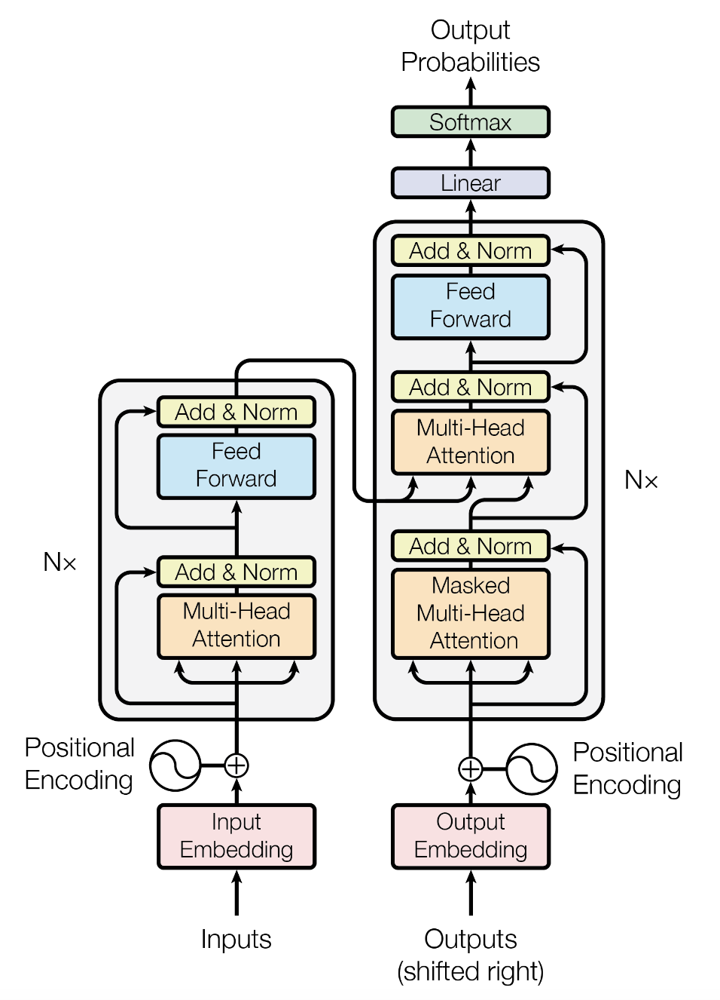
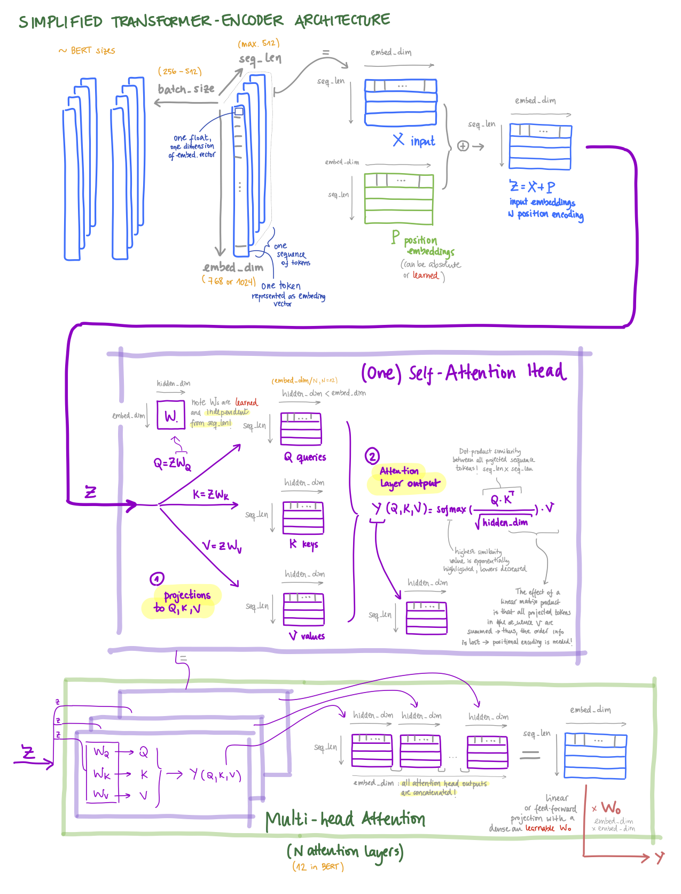

# Natural Language Processing with Transformers: My Notes

These are my notes of the book [Natural Language Processing with Transformers, by Lewis Tunstall, Leandro von Werra and Thomas Wolf (O'Reilly)](https://www.oreilly.com/library/view/natural-language-processing/9781098136789/).

Table of contents:

- [Natural Language Processing with Transformers: My Notes](#natural-language-processing-with-transformers-my-notes)
  - [Setup](#setup)
    - [Colab Setup](#colab-setup)
  - [Chapter 1: Hello Transformers](#chapter-1-hello-transformers)
    - [Key points](#key-points)
    - [Notebook](#notebook)
    - [List of papers](#list-of-papers)
  - [Chapter 2: Text Classification](#chapter-2-text-classification)
    - [Key points](#key-points-1)
    - [Notebook](#notebook-1)
    - [List of papers](#list-of-papers-1)
  - [Chapter 3: Transformer Anatomy](#chapter-3-transformer-anatomy)
    - [Key points](#key-points-2)
      - [The Encoder](#the-encoder)
      - [The Decoder](#the-decoder)
    - [Notebook and Pytorch Implementation (Transformer-Encoder)](#notebook-and-pytorch-implementation-transformer-encoder)
    - [List of papers](#list-of-papers-2)
      - [Popular Transformer Models](#popular-transformer-models)
  - [Chapter 4: Multilingual Named Entity Recognition](#chapter-4-multilingual-named-entity-recognition)
    - [Key points](#key-points-3)
    - [Notebook](#notebook-2)
    - [List of papers](#list-of-papers-3)
  - [Chapter 5: Text Generation](#chapter-5-text-generation)
    - [Key points](#key-points-4)
    - [Notebook](#notebook-3)
    - [List of papers and links](#list-of-papers-and-links)
  - [Chapter 6: Summarization](#chapter-6-summarization)
  - [Chapter 7: Question Answering](#chapter-7-question-answering)
  - [Chapter 8: Making Transformers Efficient in Production](#chapter-8-making-transformers-efficient-in-production)
  - [Chapter 9: Dealing with Few to No Labels](#chapter-9-dealing-with-few-to-no-labels)
  - [Chapter 10: Training Transformers from Scratch](#chapter-10-training-transformers-from-scratch)
  - [Chapter 11: Future Directions](#chapter-11-future-directions)

See also:

- [mxagar/tool_guides/hugging_face](https://github.com/mxagar/tool_guides/tree/master/hugging_face)
- [mxagar/generative_ai_udacity](https://github.com/mxagar/generative_ai_udacity)
- [mxagar/generative_ai_book](https://github.com/mxagar/generative_ai_book)
- [mxagar/nlp_guide](https://github.com/mxagar/nlp_guide)
- [mxagar/computer_vision_udacity/CVND_Advanced_CV_and_DL.md](https://github.com/mxagar/computer_vision_udacity/blob/main/03_Advanced_CV_and_DL/CVND_Advanced_CV_and_DL.md)
- [mxagar/deep_learning_udacity/DLND_RNNs.md](https://github.com/mxagar/deep_learning_udacity/blob/main/04_RNN/DLND_RNNs.md)

## Setup

I used Google Colab, so no setup was needed apart from the local installations in each notebook.

### Colab Setup

The following lines need to be added and modified in each notebook.

```python
# Uncomment and run this cell if you're on Colab or Kaggle
!git clone https://github.com/mxagar/nlp_with_transformers_nbs.git
%cd nlp_with_transformers_nbs
from install import *
install_requirements(is_chapter2=False) # or other chapters...

# Log in to HF with HF_TOKEN
from huggingface_hub import notebook_login
notebook_login()
```

Check the [`install.py`](./install.py) file to see what's happening with the `install_requirements` function.

## Chapter 1: Hello Transformers

### Key points

- Two major papers that led to the rise of the Transformers in NLP
  - Attention is all you need (Vaswani, 2017): Transformer model
    - Encoder-decoder architecture.
    - Self-attention to replace LSTMs, so that sequential tasks are parallelizable.
  - ULMFiT (Howard, 2017): a language model trained on a large corpus can be re-adapted for smaller corpora and other downstream tasks.
    - Transfer learning was validated also for NLP; until then, only worked in CV.
- After those papers, the two most important models were published:
  - GPT: decoder, generative model.
  - BERT: encoder.
- Encoder-decoder framework
  - Before the transformers, LSTMs were SOTA.
  - LSTMs have a hidden state which accumulates previous inputs.
  - Encoder-decoder architectures 
    - Enconder would receive an sequence of words, pass it one-by-one through the LSTM layers and obtain a final hidden state.
    - The final hidden state which would be the seed for the decoder, which would consists again of LSTM layers that would produce an output sequence.
    - That way, sequence-to-sequence tasks can be carried out, e.g., language translation or summarization.
        
    - Problems:
      - (1) Hidden state after a long sequence forgets beginning.
      - (2) We need to pass the words of the sequence one by one.
    - Solutions:
      - (1) Attention was developed (Bahdanau, 2014) and applied: attention layers learn to apply relevance weights of values/vectors; thus, instead of taking the last hidden state, it is possible to take all intermediate hidden states and apply later attention to them.
      - (2) Transformer architecture (Viswani, 2017) does not have LSTMs but MLPs which support processing the complete sequence all at once. It additionally has *self-attention*.
        
- Transfer Learning
  - Common in Computer Vision, but it was shown to work by ULMFiT (Howard, 2017).
    - In CV, fine-tuned models (body/backbone + head) work better than models trained from-scratch.
    - A work related to ULMFiT: ELMo.
  - The ULMFiT framework (they used LSTMs and the *predict-next-word* task, aka. **language modeling**):
    - Pretraining: language modeling (i.e., predict next word) with Wikipedia (large corpus).
    - Domain adaptation: language modeling (i.e., predict next word) with IMDB dataset (small corpus).
    - Fine-tuning: model is fine-tuned for a new downstream task using the adaptation dataset (IMDB), sentiment classification of moview reviews.
- First new models after Transformers were discovered:
  - GPT: decoder, generative. Trained on BookCorpus.
  - BERT: encoder. Trained on BookCorpus. Masked language modeling, predicting the masked word in a test, e.g. *I looked at my [MASK] and saw that it was late*.
- HuggingFace Transformers; examples with `pipeline`: a message to Amazon requesting the correct order is shown, and several models applied:
  - Text classification (sentiment, multi-class, multi-label)
  - Named Entity Recognition (NER): persons, locations, organizations, brands, etc.
  - Question answering: extractive QA, answers provided and location in text used for formulating answer.
  - Summarization.
  - Translation (to German).
  - Text generation: answer from Amazon is generated.
- Tools from Hugging Face:
  - Hub: Models, Datasets, Metrics
  - Libraries: Tokenizers (Rust backend), Transformers (compatible with Pytorch and Tensorflow), Datasets (compatible with Pandas and Numpy), Accelerate (abstraction of training loops for faster deployment).

### Notebook

[`01_introduction.ipynb`](./01_introduction.ipynb):

- Pipelines
- Text classification
- Named Entity Recognition
- Question Answering
- Summarization
- Translation
- Text Generation

### List of papers

- Encoder-decoder (Cho, 2014): [Learning Phrase Representations using RNN Encoder-Decoder for Statistical Machine Translation](https://arxiv.org/abs/1406.1078)
- Attention (Bahdanau, 2014): [Neural Machine Translation by Jointly Learning to Align and Translate](https://arxiv.org/abs/1409.0473)
- Transformer (Vaswani, 2017): [Attention Is All You Need](https://arxiv.org/abs/1706.03762)
- ULMFiT (Howard, 2018): [Universal Language Model Fine-tuning for Text Classification](https://arxiv.org/abs/1801.06146)
- ELMo (Peters, 2018): [Deep contextualized word representations](https://arxiv.org/abs/1802.05365)
- GPT (Radford, 2018): [Improving Language Understanding by Generative Pre-Training](https://cdn.openai.com/research-covers/language-unsupervised/language_understanding_paper.pdf)
- BERT (Devlin, 2018): [BERT: Pre-training of Deep Bidirectional Transformers for Language Understanding](https://arxiv.org/abs/1810.04805)

## Chapter 2: Text Classification

In this chapter the DistilBERT model is adapted and fine-tuned to perform tweet text classification (6 emotions detected); all the NLP pipeline is thoroughly explained. Recall that DistilBERT is originally trained to predict a masked word in a sequence.

### Key points

The complete chapter is about the implementation of the notebook [`02_classification.ipynb`](./02_classification.ipynb). Unfortunately, the notebook does not work right away due to versioning issues. However, I wrote down the most important insights.

A distilled BERT model is taken (encoding transformer) and a classifier is used with it. This classifier is used to predict 6 emotions in a dataset consisting of tweets. The model is trained in two ways:

- The embedding vectors are used to train a logistic regression model; poor performance.
- A classifier head is attached to the transformer and all the weights are trained; i.e., we perform fine-tuning. The performance is much better.

Finally, we can push the weights of the trained model to Hugging Face.

Key points:

- DistilBERT: a distilled version of BERT, much smaller (faster), but similar performance.
- Dataset: `"dair-ai/emotion"`. Six emotions assigned to tweets: `anger, love, fear, joy, sadness, surprise`.
  - **Note**: I could not download the dataset with the provided versions; I did not spend much time fixing the issue...
- We can `list_datasets`.
- We can `load_dataset` given its identifier string.
  - Then, the dataset is a dictionary which contains the keys `"train"` and `"test"`.
  - Each row is a dictionary, because the values are columnar, using Apache Arrow.
  - It is also possible to load CSV or other/similar files using `load_dataset`.
  - Dataset objects can be converted to Pandas with `.set_format(type="pandas")`.
- EDA with the dataset
  - The dataset seems highly imbalanced, but we leave it so.
  - Tweet length vs emotion is plotted in box plots.
  - Later, hex-plots are performed with text embeddings for each emotion. The embeddings are mapped to 2D using UMAP.
- Tokenization and numericalization (`token2id` dictionary)
  - Character tokenization: split by character
    - Simplest scheme, smallest vocabulary size.
    - Problem: words need to be learned from characters.
  - Word tokenization: split by white spaces.
    - Usually, stemming and lemmatizaton are also applied to reduce number of tokens.
    - Much larger vocabulary size.
    - Unknown tokens/words are mapped to `UNK` token.
    - Large vocabularies require many weights in the NN
  - **Subword tokenization**: words are split, combining the best features of the previous two.
    - We can deal with misspellings
    - It is learned from a pretraining corpus.
    - Many subword tokenizers; **WordPiece** used by BERT and DistilBERT.
  - `AutoTokenizer` provides the correct tokenizer for each model; we can also manually instantiate the proper tokenizer for our model (e.g., `DistilBertTokenizer`).
  - Common methods of the tokenizer:
    ```python
    tokenizer = AutoTokenizer.from_pretrained("distilbert-base-uncased")
    encoded_text = tokenizer(text)
    tokens = tokenizer.convert_is_to_tokens(encoded_text.input_ids)
    tokenizer.vocab_size # 30k
    tokenizer.model_max_length # 512, context size
    ```
  - Common features of the used subword tokenizer:
    - Words are split in endings and `##` is appended to the suffixes: `tokenizing -> token, ##izing`.
    - Special tokens are defined: `[PAD], [UNK] (unknown), [CLS] (start), [SEP] (end), [MASK]`.
    - We tokenize the entire dataset by padding if sequence is shorter and truncating otherwise.
    - The output ids have a value `attention_mask`, which is `1` usually, `0` if the token is padded.
    - To tokenize the entire dataset, we define a `tokenize()` function and `map()` it to the dataset.
- Approach 1: Transformers as feature extractors
  - Token embeddings are generated and saved as a dataframe.
    - The selected embeddings are the hidden states from the transformer; for classification, the hidden states of the first token `[CLS]`.
    - We can see that the dimension of the output vector is `(batch_size, seq_len, hidden_size)`; the `hidden_size = 768`.
  - Then, a separate model is trained with the dataframes: logistic regression (choice in the chapter), random forest, XGBoost, etc.
  - The baseline of the classification is the random `DummyClassifier` from Scikit-Learn. Always do this! It is helpful in imbalanced multi-classes cases.
  - The result is a score of 63% (F1); the confusion matrix shows the miss-classifications.
- Approach 2: Add a classification head and fine-tune everything.
  - A classification head which is differentiable is added; that can be done automatically with `AutoModelForSequenceClassification`, for which we specify `num_labels = 6`.
  - We train everything with a `Trainer` instance, which takes:
    - `TrainingArguments`: a class with hyperparameters
    - A custom defined `compute_metrics` function; it receives a `EvalPrediction` object and returns a dictionary with the metric values.
    - The train and eval datasets
    - The `tokenizer`
  - After training, we can `trainer.predict()`: 91% (F1), much better!
  - Error analysis: if we pass a validation split to the `predict` method, we get the loss of each observation, thus, we can list the mis-predictions by loss. Then, we perform an error analysis to detect:
    - Wrong labels.
    - Quirks of the dataset: spacial characters can lead to wrong classifications, maybe we discover new ways of cleaning the data, etc.
    - Similarly, we should look at the samples with the lowest losses.
- Interoperability between frameworks: in some cases the weights of some models are in Pytorch and we'd like to have them in Tensorflow; we can do that using Hugging Face.
- It is also possible to train with Keras.
- We can push the weights of the trained model using `trainer.push_to_hub()`.
- We need to log in to Hugging Face.

### Notebook

[`02_classification.ipynb`](./02_classification.ipynb)

Unfortunately, the notebook does not work right away due to versioning issues.
However, I wrote down the most important insights in the section before.

### List of papers

- DistilBERT (Sanh, 2019): [DistilBERT, a distilled version of BERT: smaller, faster, cheaper and lighter](https://arxiv.org/abs/1910.01108)

## Chapter 3: Transformer Anatomy

This chapter explains the architecture of the transformer.

### Key points

The original Transformer architecture (Vaswani et al., 2017) is based on the **encoder-decoder** architecture:

- The encoder converts input sequence (tokens) into embedding vectors, i.e., **hidden states** or **context**.
- The decoder converts those hidden states into an output sequence.




The original model was used for translation tasks, i.e., from an input sequence in a language to the output sequence in another language. However, the original architecture was quickly split into 3 families:

- Encoder-only: convert input sequence into an embedding that can be used in downstream tasks (classification, etc.).
  - Examples: BERT, DistilBERT, RoBERTa
  - Training is done with masked tokens, thus, left and right parts of a token are used to compute the representation, i.e., **bi-directional attention**.
- Decoder-only: autocomplete a sequence by predicting the most probable next word/token.
  - Example: GPT
  - Training is done to predict next word, so only the left pert of a token is used, aka. **causal or autoregressive attention**.
- Encoder-decoder: from sequence to sequence.
  - Examples: BART, T5.

Some other features of the architecture:

- The line between the 3 branches is a bit blurry: decoders can also translate and encoders can also summarize!
- The components of the architecture are quite simple; we have blocks that contain:
  - Attention layers: similarities of the tokens in the sequence are computed simultaneously (i.e., dot product) and used to weight and sum the embeddings in successive steps.
  - Feed-forward layers: linear transformations of embeddings.
  - Positional embeddings/encodings: since the transformed embeddings are continuously the sum of weighted embeddings, we need to add the lost position information somehow; that can be achieved in different ways using positional embeddings.
  - Normalization
- Both the encoder and the decoder use similar blocks; however
  - The encoder transforms embeddings in successive steps to produce the output embeddings.
  - The decoder takes the output embeddings from the encoder as well as some hidden states and generates a new sequence, which is finished when the `EOS` token (end-of-sentence) emerges.

#### The Encoder

Components (in order):

- **Embedding layer**: tokens are converted into vectors; BERT, `embed_dim = 768 (base) or 1024 (large)`.
- **Positional embeddings/encodings** are added: since the attention layer computes a weighted sum of all tokens in the sequence, we need to encode the position of the tokens. There are several ways:
  - Learnable positional embeddings (applied in the examples here): a learnable embedding layer is added; this is the most popular approach nowadays if the dataset is large enough.
  - Absolute positional representations (original paper): static patterns consisting of modulates sine/cosine patterns; useful for small datasets.
  - Relative positional representations: the attention mechanism is modified incorporating the relative embedding positions.
- `Nx` encoder blocks stacked serially; BERT, N = 12 (base) or 24 (large).  
  One **encoder block** has:
    - **Multi-head self attention + Concatenation + Feed-forward**.
    - Each multi-head attention layer has M self-attention heads; BERT, M = 12 (base) or 16 (large).
      - Each **(self-)attention head** decomposes the input embedding sequences into M sequences that are later concatenated again to form an updated embedding. After decomposition, hidden embedding sequences are created, upon which self-attention is applied:
        - We transform the original embedding into Q (query), K (key), V (value). The transformation is performed by a linear/dense layer, which is learned.
          - Q: ingredients in a recipe are the queries.
          - K: the shelf-labels in the supermarket are the keys; they need to match: similarity function.
          - V: the item in the shelf is the value.
        - Q and K are used to compute a similarity score between token embedding against token embedding (dot product).
        - The similarity is used as a weight to sum all token embeddings from V to yield a new set of hidden embeddings. These are called **contextualized embeddings**, because they contain context information, i.e., the information of the surrounding embeddings. These updates and context integration solves issues like homonyms or difference in word order between different languages.

The attention block is called *self-attention block* because all attention/similarity weights are computed simultaneously for the entire sequence using only the embeddings themselves. In contrast, for RNNs, the attention is computed calculating the relevance of a encoder hidden state wrt. the decoder hidden state, sequentially. Here everything happens simultaneously and in the encoder.

The output embeddings from each encoder block have the same size as the input embeddings, so the encoder block stack has the function of updating those embeddings. This is the summary of the sizes:

- Input embedding sequence: `(batch_size, seq_len, embed_dim)`.
- Embeddings being transformed inside a self-attention layer: `(batch_size, seq_len, head_dim = embed_dim / M)`.
- Embeddings being transferred from one multi-head block to another: `(batch_size, seq_len, hidden_dim = embed_dim)`.



In addition to the already mentioned components, each encoder block has also:

- Layer normalization: inputs/outputs are normalized to mean 0, std 1. This normalization can be pre-layer (original) or post-layer (most common nowadays).
- Skip connections: previous embeddings (before transformations/updates) are added. These skip/residual connections
  - Minimize the gradient vanishing problem.
  - Enable deeper networks.
  - Improve the optimization of the loss function.
- Positional feed-forward layer: two linear/dense matrices (followed by a dropout) further transform the embeddings. Usually, 
  - the first transformation increases 4x the size of the embeddings 
  - and the second scales back the embeddings to their original size.


Finally, if we want to use the encoder stand-alone, we can add a classification head to it; traditionally, the first token in the output hidden embedding sequence is used as the input for the classification. If don't what to perform classification, we can add the decoder to it.

#### The Decoder

The original Transformer was conceived for language translation:

- The Encoder receives the input sequence (e.g., text in English).
- The Decoder produces an output sequence (e.g., text in French).

However, we can also only train the Decoder, for instance, to generate a new text, which is done predicting the next word iteratively: we take every step the so far predicted sequence and input it to the decoder again. That's why such systems are called **auto-regressive**.

If we consider the **full Transformer** (Encoder-Decoder, e.g., for language EN-FR translation), the Decoder takes:

- `K` and `V` from the last Encoder block: these are basically the final hidden states of the processed input sequence (e.g., English text).
- During training, the embeddings of the target sequence are fed (e.g., French text) shifted one token to the right, i.e., one word/token less and `<start>` as initial token.
  - During inference, the only input target sequence is the first token `<start>`.
- Positional embeddings of the target sequence, as for the Encoder.

The Decoder consists of `Nx` blocks (the original paper had 6, GPT-3 has 96, LLama-2 has 32/40/80). The building elements of the Decoder are very similar to the Encoder (see original architecture diagram), but attention layers are slightly different:

- It has a **Masked multi-head self-attention layer**: the tokens of the future time-steps are masked, i.e., set to be zero (if probabilities, or `-inf` if logits), so that the decoder is able to learn only from the past tokens/embeddings (otherwise, it could cheat). The implementation is very simple, and its carried out in the `scaled_dot_product_attention` function from the implementation below.
- It has an **Encoder-decoder attention layer**: `Q` is computed from the Decoder embeddings, but `K` and `V` come from the Encoder. This way, the Decoder learns to relate two sequences. Note that:
  - The `K` and `V` of the final Encoder step/block are used in each Decoder step/block; so `K` and `V` are "frozen", i.e., the same for all steps.
  - The `Q` is computed in the Decoder for every new step/block; `Q` refers to the sequence generated so far, while `K` and `V` refer to the original sequence.
  - Unlike in the Encoder, the `Q, K, V` matrices can have different sizes, so the attention scores matrix can be rectangular.


Note that in sequence-to-sequence models usually **Teacher forcing** is used, which involves using the actual target output (the ground truth) from the training data as the input to the next time step in the sequence, rather than using the model's own predicted output from the previous time step.

### Notebook and Pytorch Implementation (Transformer-Encoder)

In the following, a simple implementation of the **Transformer-Encoder** is provided: [`transformer_encoder.py`](./transformer_encoder.py). It is based on the code provided in the notebook [`03_transformer-anatomy.ipynb`](./03_transformer-anatomy.ipynb).

For an example implementation of the **Transformer-Decoder**, see [minGPT by Karpathy](https://github.com/karpathy/minGPT).

```python
"""This is a very simple implementation
of the Transfomer-Encoder, following the
book

    Natural Language Processing with Transformers
    
by Tunstall et al.

Dependencies:
- transformers
- torch

The configuration class from AutoConfig is the following:

    BertConfig {
    "_name_or_path": "bert-base-uncased",
    "architectures": [
        "BertForMaskedLM"
    ],
    "attention_probs_dropout_prob": 0.1,
    "classifier_dropout": null,
    "gradient_checkpointing": false,
    "hidden_act": "gelu",
    "hidden_dropout_prob": 0.1,
    "hidden_size": 768,
    "id2label": {
        "0": "LABEL_0",
        "1": "LABEL_1",
        "2": "LABEL_2"
    },
    "initializer_range": 0.02,
    "intermediate_size": 3072,
    "label2id": {
        "LABEL_0": 0,
        "LABEL_1": 1,
        "LABEL_2": 2
    },
    "layer_norm_eps": 1e-12,
    "max_position_embeddings": 512,
    "model_type": "bert",
    "num_attention_heads": 12,
    "num_hidden_layers": 12,
    "pad_token_id": 0,
    "position_embedding_type": "absolute",
    "transformers_version": "4.16.2",
    "type_vocab_size": 2,
    "use_cache": true,
    "vocab_size": 30522
    }
"""
import torch
from math import sqrt
from torch import nn
from transformers import AutoConfig
from transformers import AutoTokenizer


def scaled_dot_product_attention(query, key, value, mask=None):
    """Attention is implemented here.
    It is called self-attention because we use only the encoder hidden states
    to compute all similarities between tokens in the sequence simultaneously.
    That means, no decoder hidden states are used. The output is a set of
    contextualized embeddings, i.e., a weighted sum of all the embeddings,
    which captures the context information."""
    dim_k = query.size(-1)
    # Batch matrix-matrix product
    scores = torch.bmm(query, key.transpose(1, 2)) / sqrt(dim_k)
    if mask is not None:
        # This masked option is for the Decoder part
        # not the Encoder. We can create a bottom-triangular matrix
        # with 1s (bottom part) and 0s (upper part) as follows:
        # mask = torch.tril(torch.ones(seq_len, seq_len)).unsqueeze(0)
        scores = scores.masked_fill(mask == 0, float("-inf"))
    weights = F.softmax(scores, dim=-1)
    # This matrix multiplication produces a weighted sum of all value vectors
    # which is a set of contextualized embeddings
    return weights.bmm(value)


class AttentionHead(nn.Module):
    """Self-attention head."""
    def __init__(self, embed_dim, head_dim):
        super().__init__()
        self.q = nn.Linear(embed_dim, head_dim)
        self.k = nn.Linear(embed_dim, head_dim)
        self.v = nn.Linear(embed_dim, head_dim)

    def forward(self, hidden_state):
        attn_outputs = scaled_dot_product_attention(
            self.q(hidden_state), self.k(hidden_state), self.v(hidden_state))
        return attn_outputs


class MultiHeadAttention(nn.Module):
    """It combines several attention heads (M = 12 in BERT base).
    Orange block in the original paper diagram."""
    def __init__(self, config):
        super().__init__()
        embed_dim = config.hidden_size
        num_heads = config.num_attention_heads
        head_dim = embed_dim // num_heads
        self.heads = nn.ModuleList(
            [AttentionHead(embed_dim, head_dim) for _ in range(num_heads)]
        )
        self.output_linear = nn.Linear(embed_dim, embed_dim)

    def forward(self, hidden_state):
        x = torch.cat([h(hidden_state) for h in self.heads], dim=-1)
        x = self.output_linear(x)
        return x


class FeedForward(nn.Module):
    """Often called Positional Feed-Forward layer.
    Blue block in the original paper diagram."""
    def __init__(self, config):
        super().__init__()
        # The intermediate_sie is often 4x the hidden_size = embed_dim
        self.linear_1 = nn.Linear(config.hidden_size, config.intermediate_size)
        self.linear_2 = nn.Linear(config.intermediate_size, config.hidden_size)
        self.gelu = nn.GELU()
        self.dropout = nn.Dropout(config.hidden_dropout_prob)
        
    def forward(self, x):
        x = self.linear_1(x)
        x = self.gelu(x)
        x = self.linear_2(x)
        x = self.dropout(x)
        return x
    

class TransformerEncoderLayer(nn.Module):
    """This class is a single encoder block which contains
    
    - a multi-head attention layer (with several attention heads + a linear layer),
    - normalization layers (inputs in the batch are transformed to have zero mean and unity variance),
    - a positional feed-forward layer,
    - and skip connections (to avoid gradient vanishing and enable deeper networks).
    
    This block is the grayed block in the original paper diagram,
    repeated Nx, being in BERT N = 12 (base) or 16 (large).
    
    Note that the arrangement in which we apply layer normalization and skip connections
    might vary:
    
    - Post-layer normalization (original paper): trickier to train.
    - Pre-layer normalization (most common now, applied here): more stable during training.
    """
    def __init__(self, config):
        super().__init__()
        self.layer_norm_1 = nn.LayerNorm(config.hidden_size)
        self.layer_norm_2 = nn.LayerNorm(config.hidden_size)
        self.attention = MultiHeadAttention(config)
        self.feed_forward = FeedForward(config)

    def forward(self, x):
        # Apply layer normalization and then copy input into query, key, value
        hidden_state = self.layer_norm_1(x)
        # Apply attention with a skip connection
        x = x + self.attention(hidden_state)
        # Apply feed-forward layer with a skip connection
        x = x + self.feed_forward(self.layer_norm_2(x))
        return x


class Embeddings(nn.Module):
    """This layer creates the embeddings from token input ids.
    It is applied only in the beginning.
    In addition, positional embeddings are added here, too; these are needed
    because the attention layer computes a weighted sum of all token embeddings,
    so the outputs loose the positional information.
    
    There are several ways to add positional information:
    
    - Learnable positional embeddings (applied here): a learnable embedding layer
    is added; this is the most popular approach nowadays if the dataset is large enough.
    - Absolute positional representations (original paper): static patterns
    consisting of modulates sine/cosine patterns; useful for small datasets.
    - Relative positional representations: the attention mechanism is modified incorporating
    the relative embedding positions.
    """
    def __init__(self, config):
        super().__init__()
        self.token_embeddings = nn.Embedding(config.vocab_size, 
                                             config.hidden_size)
        self.position_embeddings = nn.Embedding(config.max_position_embeddings,
                                                config.hidden_size)
        self.layer_norm = nn.LayerNorm(config.hidden_size, eps=1e-12)
        self.dropout = nn.Dropout()

    def forward(self, input_ids):
        # Create position IDs for input sequence
        seq_length = input_ids.size(1)
        position_ids = torch.arange(seq_length, dtype=torch.long).unsqueeze(0)
        # Create token and position embeddings
        token_embeddings = self.token_embeddings(input_ids)
        position_embeddings = self.position_embeddings(position_ids)
        # Combine token and position embeddings
        embeddings = token_embeddings + position_embeddings
        embeddings = self.layer_norm(embeddings)
        embeddings = self.dropout(embeddings)
        return embeddings


# This is the Transformer-Encoder without any downstream/task head
# We need to pass to it a tensor with token ids, so the tokenization
# and the vocabulary need to be generated.
class TransformerEncoder(nn.Module):
    """The final but task-less Transformer-Encoder."""
    def __init__(self, config):
        super().__init__()
        self.embeddings = Embeddings(config)
        self.layers = nn.ModuleList([TransformerEncoderLayer(config) 
                                     for _ in range(config.num_hidden_layers)])

    def forward(self, x):
        x = self.embeddings(x)
        for layer in self.layers:
            x = layer(x)
        return x


# This is the Transformer-Encoder with a classification task head
class TransformerForSequenceClassification(nn.Module):
    """The final Transformer-Encoder with a classification task."""
    def __init__(self, config):
        super().__init__()
        self.encoder = TransformerEncoder(config)
        self.dropout = nn.Dropout(config.hidden_dropout_prob)
        self.classifier = nn.Linear(config.hidden_size, config.num_labels)
        
    def forward(self, x):
        x = self.encoder(x)[:, 0, :] # select hidden state of [CLS] token
        x = self.dropout(x)
        x = self.classifier(x)
        return x


if __name__ == "__main__":

    model_ckpt = "bert-base-uncased"
    text = "time flies like an arrow"

    # We need to tokenize our inputs to ids to pass them to the transformer
    tokenizer = AutoTokenizer.from_pretrained(model_ckpt)
    # The configuration class contains many parameters,
    # it's like a dictionary which contains all of them together
    # and the code is much cleaner
    config = AutoConfig.from_pretrained(model_ckpt)

    # Here, special tokens as CLS and SEP as excluded for simplicity
    inputs = tokenizer(text, return_tensors="pt", add_special_tokens=False)
    # inputs.input_ids: tensor([[ 2051, 10029,  2066,  2019,  8612]])
    token_emb = nn.Embedding(config.vocab_size, config.hidden_size)
    # Embedding(30522, 768)
    inputs_embeds = token_emb(inputs.input_ids)
    # torch.Size([1, 5, 768]): (batch_size, seq_len, hidden_size = embed_dim)
    
    multihead_attn = MultiHeadAttention(config)
    attn_outputs = multihead_attn(inputs_embeds)    
    # torch.Size([1, 5, 768]): (batch_size, seq_len, hidden_size = embed_dim)
    
    feed_forward = FeedForward(config)
    ff_outputs = feed_forward(attn_outputs)
    # torch.Size([1, 5, 768]): (batch_size, seq_len, hidden_size = embed_dim)
    
    encoder_layer = TransformerEncoderLayer(config)
    # torch.Size([1, 5, 768]): (batch_size, seq_len, hidden_size = embed_dim)
    
    embedding_layer = Embeddings(config)
    # torch.Size([1, 5, 768]): (batch_size, seq_len, hidden_size = embed_dim)
    
    # This is the Transformer-Encoder without any downstream/task head
    # We need to pass to it a tensor with token ids, so the tokenization
    # and the vocabulary need to be generated.
    encoder = TransformerEncoder(config)
    outputs = encoder(inputs.input_ids)
    # torch.Size([1, 5, 768]): (batch_size, seq_len, hidden_size = embed_dim)

    # This is the Transformer-Encoder with a classification task head
    config.num_labels = 3
    encoder_classifier = TransformerForSequenceClassification(config)
    classes = encoder_classifier(inputs.input_ids)
    # torch.Size([1, 3]): (batch_size, num_labels)
```

### List of papers

- Transformer (Vaswani et al., 2017): [Attention Is All You Need](https://arxiv.org/abs/1706.03762)
- ELMo Contextualized embeddings (Peters et al., 2018): [Deep Contextualized Word Representations](https://arxiv.org/abs/1802.05365)
- GLUE Benchmark (Wang et al., 2018): [GLUE: A Multi-Task Benchmark and Analysis Platform for Natural Language Understanding](https://arxiv.org/abs/1804.07461)

#### Popular Transformer Models

- Encoder-only: sequence-to-embeddings.
  - BERT (Devlin et al., 2018 - Google): [BERT: Pre-training of Deep Bidirectional Transformers for Language Understanding](https://arxiv.org/abs/1810.04805)
    - Outperformed GLU: Natural Language Understanding (NLU) benchmark.
    - Trained with two goals: predict masked word, predict if one text passage follows another.
  - DistilBERT (Sanh et al., 2019 - HuggingFace): [DistilBERT, a distilled version of BERT: smaller, faster, cheaper and lighter](https://arxiv.org/abs/1910.01108)
    - 97% of BERT's performance, but 40% less memory and 60% faster.
  - RoBERTa (Liu et al., 2019 - Meta/Facebook): [RoBERTa: A Robustly Optimized BERT Pretraining Approach](https://arxiv.org/abs/1907.11692)
    - Performance of BERT improved by changing the training scheme.
  - XLM (Lample et al., 2019 - Meta/Facebook): [Cross-lingual Language Model Pretraining](https://arxiv.org/abs/1901.07291)
- Decoder-only: sequence generation.
  - GPT (OpenAI): next word prediction.
    - GPT-1 (Radford et al., 2018): [Improving Language Understanding by Generative Pre-Training](https://openai.com/index/language-unsupervised/)
    - GPT-2 (Radford et al., 2019): [Language Models are Unsupervised Multitask Learners](https://openai.com/index/better-language-models/)
    - GPT-3 (Brown et al., 2020): [Language Models are Few-Shot Learners](https://arxiv.org/abs/2005.14165)
      - Power laws govern the relation between compute, dataset size, model size and performance.
      - 175 billion parameters.
      - Few-shot learning.
  - Llama (Meta/Facebook)
    - Llama 1 (Touvron et al., 2023): [LLaMA: Open and Efficient Foundation Language Models](https://arxiv.org/abs/2302.13971)
    - Llama 2 (Touvron et al., 2023): [Llama 2: Open Foundation and Fine-Tuned Chat Models](https://arxiv.org/abs/2307.09288)
    - Llama 3 (Dubey et al., 2024): [The Llama 3 Herd of Models](https://arxiv.org/abs/2407.21783)
  - Mixtral (Jiang et al., 2024 - Mistral): [Mixtral of Experts](https://arxiv.org/abs/2401.04088)
  - Phi-1 (Gunasekar et al., 2023 - Microsoft): [Textbooks Are All You Need](https://arxiv.org/abs/2306.11644)
- Encoder-Decoder: sequence-to-sequence.
  - BART (Lewis et al., 2029 - Meta/Facebook): [BART: Denoising Sequence-to-Sequence Pre-training for Natural Language Generation, Translation, and Comprehension](https://arxiv.org/abs/1910.13461)
  - T5 (Raffel et al., 2019 - Google): [Exploring the Limits of Transfer Learning with a Unified Text-to-Text Transformer](https://arxiv.org/abs/1910.10683)
    - Original Transformer architecture.
    - All tasks framed as text-to-text, even classification is possible by producing a label text.
  - Big Bird (Zaheer et al., 2020 - Google): [Big Bird: Transformers for Longer Sequences](https://arxiv.org/abs/2007.14062)
    - Context size increases quadratically memory, because attention is a matrix.
    - Big Bird uses a sparse attention which scales linearly.

## Chapter 4: Multilingual Named Entity Recognition

This chapter shows:

- How a head can be manually defined to a transformer-encoder body.
- Fine-tuning of models for token classification, i.e., NER (Named Entity Recognition)
- How a multi-lingual backbone can be fine-tuned for a mono-lingual task/dataset, but still works for languages it wasn't trained for.

### Key points

- Definitions
  - *Zero-shot cross-lingual transfer* = a model which is fine-tuned on one language can be applied to others without further training.
    - *Zero-shot* also refers to the cases where the training and test/evaluation labels are different.
  - NER: Named Entity Recognition = detect special names, like
    - Organization: `ORG`
    - Person: `PER`
    - Location: `LOC`
- **Used dataset: PAN-X**, a subset of XTREME: Cross-lingual transfer evaluation of multilingual encoders; it contains text from Wikipedia articles in many languages.
  - 7 classes:
    - `B-ORG`, `I-ORG`: begin and continue organization tokens
    - `B-PER`, `I-PER`: begin and continue person tokens
    - `B-LOC`, `I-LOC`: begin and continue location tokens
    - `0`: token doesn't belong to any entity
  - Subset of used languages: the ones in Switzerland: German `de`, French `fr`, Italian `it`, English `en`; also, the balance percentages are adjusted to the usage in Switzerland.
  - We check that the number of entity classes is balanced, too.
  - The initial fine-tuning is performed only for German.
- **Used model: XLM-RoBERTa (XLM-R)**; same architecture as BERT, but training scheme is different. Good choice for multi-lingual NLU tasks (Natural Language Understanding).
  - The model is pretrained with 100s of languages.
  - It uses a different tokenizer: SentencePiece (instead of WordPiece).
    - WordPiece has `[CLS]` and `[SEP]` (start and end), and `##` (to denote broken word parts)
    - SentencePiece uses `<s>` and `</s>`, and `▁` (to denote preceding white space); it is better suited to detokenize without ambiguities.
  - Vocabulary size: 250k (instead of 55k).
- Tokenizer pipelines consist of these steps
  - Normalization
    - Clean: strip whitespaces, remove accents
    - Unicode normalization: convert special symbols to unified Unicode
    - Lowercase
  - Pretokenization
    - Split text into smaller objects: usually, words and punctuation
  - Tokenizer model
    - Sub-word splitting: this reduces the vocabulary size and the number of out-of-vocabulary tokens; it is also a way of handling misspellings.
    - This needs to be trained on a corpus.
    - For token classification, as convention in the chapter, if a word is broken into pieces, only the first part is labeled with the proper NER class, and the rest is labeled as ignored `IGN` (default id -100 in Pytorch). After the inference, it is easy to propagate the first predicted class to the subsequent `IGN` tokens.
  - Postprocessing
    - Add special tokens: `[CLS]`, `[SEP]`
- Model architecture: `BertModel` (body: task agnostic) and `BertForTask` (body + head: task-specific)
  - In the *sequence classification* architecture from Chapter 2, the first hidden state of the output sequence (`[CLS]`) was taken and passed to alinear layer which mapped to the desired classes. Now, we want to perform a *token classification*, thus, all the output hidden states of the sequence  are passed each to a linear mapping to classify them (7 classes).
    
  - HF Transformers already has classes for that:
    - `AutoModelFor<Task>`: model class chosen from passed model string.
    - `<Model>For<Task>`, e.g., **`XLMRobertaForTokenClassification`**: the class necessary here.
      - XLM-Roberta is in essence the same architecture as BERT, but it was trained with another setting and dataset
  - However, a class is created maually, for learning purposes; this class implements the head, given the body (XLM-Roberta):
    ```python
    import torch.nn as nn
    from transformers import XLMRobertaConfig
    from transformers.modeling_outputs import TokenClassifierOutput
    from transformers.models.roberta.modeling_roberta import RobertaModel
    from transformers.models.roberta.modeling_roberta import RobertaPreTrainedModel

    # Since inherited from PretrainedModel, we get access to all Transformers utilities!
    class XLMRobertaForTokenClassification(RobertaPreTrainedModel):
        # When initialized, standard XLM-R settings are loaded and used
        config_class = XLMRobertaConfig

        def __init__(self, config):
            super().__init__(config)
            self.num_labels = config.num_labels
            # Load model body
            # add_pooling_layer=False: ensure all hidden states are returned, not only first
            self.roberta = RobertaModel(config, add_pooling_layer=False)
            # Set up token classification head
            self.dropout = nn.Dropout(config.hidden_dropout_prob)
            self.classifier = nn.Linear(config.hidden_size, config.num_labels)
            # Load and initialize weights
            self.init_weights()

        # One forward pass defined
        def forward(self, input_ids=None, attention_mask=None, token_type_ids=None, 
                    labels=None, **kwargs):
            # Use model body to get encoder representations
            outputs = self.roberta(input_ids, attention_mask=attention_mask,
                                  token_type_ids=token_type_ids, **kwargs)
            # Apply classifier to encoder representation
            sequence_output = self.dropout(outputs[0])
            logits = self.classifier(sequence_output)
            # Calculate losses
            loss = None
            if labels is not None:
                # If we provide labels, loss is computed
                loss_fct = nn.CrossEntropyLoss()
                loss = loss_fct(logits.view(-1, self.num_labels), labels.view(-1))
            # Return model output object
            return TokenClassifierOutput(loss=loss, logits=logits, 
                                        hidden_states=outputs.hidden_states, 
                                        attentions=outputs.attentions)
    ```
- Special effort is put in tokenization and alignment
- For evaluation, specific functions are defined using the library `seqeval`
  - We perform sequence evaluation: all tokens in a seuence must be correct for the sequence to be correct.
- Training (fine-tuning)
  - A `TrainingArguments` class is instantiated, as well as a `Trainer`.
  - Additionally, since we'll push the model to HF
    - We need to log in to HF allowing git credentials
    - We need to create a repository in HF (done programmatically)
  - A data collator is used for the batches: the sequences are padded to the largest sequence in the batch
  - After training, the resulting fine-tuned model is pushed to HF: [`mxagar/xlm-roberta-base-finetuned-panx-de`](https://huggingface.co/mxagar/xlm-roberta-base-finetuned-panx-de)
- Error Analysis
  - Evaluation: confusion matrix
    - `B-ORG` and `I-ORG` are confused the most.
  - Look at valiadion samples with the highest loss: sum of all losses for all tokens in the sequence
    - Realization: some labels are wrong!
    - PAN-X is a so called *silver standard* (i.e., labeling was automated), vs *gold standard* datasets (i.e., labeling done by humans).
    - Usually, iterations are done after correcting the labels
- Cross-lingual transfer
  - Recall: XLM-Roberta was trained in 100s of langueges, but we fine-tune only for German.
  - However, the fine-tuned model seems to still work well with unseen languages! This is **zero-shot learning**
    - The transfer result is usually better for languages within the same family.
  - F1 for
    - `de`: 87%
    - `fr`: 70%
    - `it`: 65%
    - `en`: 58%
  - To see when it makes sense to use zero-shot learning, the model is further fine-tuned with subsets of `fr` dataset of increasing amounts and the F1 is computed
    - Result: we get the amount of samples required so that fine-tuning is better than cross-lingual transfer with zero-shot learning
    - This is relevant to decine when to collect and label samples!
- Finally, `de`+`fr` language splits are concatenated and a model is trained with all the languages; better results are achieved, but not only for `de`+`fr`, aslo for `it` and `en`
  - Learning: fine-tuning a cross-lingual for multiple languages improves the performance with other languages, specially from the same family

### Notebook

All the implementation is done in [`04_multilingual-ner.ipynb`](./04_multilingual-ner.ipynb).

### List of papers

- XTREME Dataset (Hu et al., 2020): [XTREME: A Massively Multilingual Multi-task Benchmark for Evaluating Cross-lingual Generalization](https://arxiv.org/abs/2003.11080)
- XLM-RoBERTa (Conneau et al., 2020): [Unsupervised Cross-lingual Representation Learning at Scale](https://arxiv.org/abs/1911.02116)

## Chapter 5: Text Generation

This chapter does not deal with the decoder part of the Transformer model; instead, two aspects related to the *next-word* sequence generation are introduced:

- Token search during decoding: greedy vs. beam.
- Sampling: temperature, top-k and top-p.

### Key points

- Unexpected feature of the Transformers: they can create text almost undistinguishable from humans.
- Eventhough Transformers are trained without explicit supervision, they learn to carry out zero-shot tasks
  - Simple sums
  - Code generation
  - Missspelling correction
  - Translations
  - etc.
- However, note that related texts must occur usually naturally in the training set.
- Decoding: given an input prompt a word/token is generated, which is concatenated to the input prompt, and the next word is generated iteratively until we obtain an `EOS` token or we reach the maximum amount of tokens.
  - Encoder-Decoder differences:
    - In the encoder, we input the entire sequence to the model and obtain the output sequence in a single pass
    - In the decoder, we need at least one forward pass for each output token: that requires more resources!
    - In the decoder, we have some hyperparameters post-training which affect the generation, related to the search method and the sampling method.
  - In reality, predicting the next token and extending the input sequence in an autoregressive way is a simplification; the formal method would be to predict a tree of all possible token choices, but that is not feasible in practice.
  - Two main decoding or selection strategies are used:
    - **Greedy Search Decoding**: at each step, we select (=decode) the token with the highest probability.
      - It's easy to implement, but we can use the built-in `generate()` method instead, which offers more options.
    - **Beam Search Decoding**: we select an integer value for `b = number_beams`, and keep track of the most probable next tokens building a tree of options. The most likely paths/beams are chosen, ranking the beams with their summed log probabilities.
      - We would take the product of (conditional) probabilities, but since that's too small, we use the equivalent sum of log probabilities.
      - The more beams we choose, the better the quality, but the computational effort explodes.
      - Beam search sometimes suffers from repetitive generation; one way to avoid that is using n-gram penalty, i.e., we penalize the repetition of n-grams.
      - This is commonly used in summarization and machine translation.
- Sampling Methods: for any given decoding/next-word-search strategy, we can decide to sample in different ways; factors that affect here:
  - **Temperature**: we get the token probabilities as output from the generative LLM; if we apply a `softmax` with the inverse of a `Temperature` variable as the exponent, we reshape the token probability distribution (Boltzman distribution):
    - `T >> 1`: small ps get bigger, large ps smaller -> more homogeneous distribution -> more **creativity / diversity**, because any word/token could be chosen.
    - `T = 1`: ps are not changed from the original output.
    - `T << 1`: small ps smaller, large ps larger -> more peaked distribution -> less creativity and more **coherence**, because the most likely words are chosen.
    - We can decide to apply `T` for any decoding strategy or sampling method: greedy/beam search, top-k/p sampling.
  - **Top-k**: instead of considering all tokens each with their p (with or without `T`), we reduce it to the `k` most likely ones and select from them using their distributions.
  - **Nucleus Sampling or Top-p**: instead of making the number `k` of the most likely ones to be considered fixed, we make it dynamic by specifying the cumulated probability threshold from which we cut the less likely tokens off; e.g., `top_k = 0.9`: we consider the first ranking tokens which cumulate up to `p = 0.9`.
    - We can combine `top_k` and `top_p`: usually the `k` are chosen and the cummulative `p` is applied.

### Notebook

All the implementation is done in [`05_text-generation.ipynb`](./05_text-generation.ipynb).

Even though many things are shown in the notebook, the practical lines to generate text are the following:

```python
import torch
from transformers import AutoTokenizer, AutoModelForCausalLM

device = "cuda" if torch.cuda.is_available() else "cpu"
model_name = "gpt2-xl"
tokenizer = AutoTokenizer.from_pretrained(model_name)
model = AutoModelForCausalLM.from_pretrained(model_name).to(device)

# Input text
max_length = 128
input_txt = """In a shocking finding, scientist discovered \
a herd of unicorns living in a remote, previously unexplored \
valley, in the Andes Mountains. Even more surprising to the \
researchers was the fact that the unicorns spoke perfect English.\n\n
"""
input_ids = tokenizer(input_txt, return_tensors="pt")["input_ids"].to(device)

# Run generative model
output = model.generate(
  input_ids,
  max_length=max_length,
  num_beams=5, # Optional, number of beams - otherwise greedy search
  do_sample=True, # Optional, if we'd like to use top_k/p sampling
  temperature=2.0, # Optional, if we'd like t o alter the ps
  top_k=0, # Optional, sampling from k most likely
  top_p=0.90 # Optional, sampling from most likely that cummulate p=90%
)

# Decoded text
print(tokenizer.decode(output[0]))
```

### List of papers and links

- GPT-2 (Radford et al., 2019)[Language Models are Unsupervised Multitask Learners ](https://paperswithcode.com/paper/language-models-are-unsupervised-multitask)
- GPT-2 Code: [`openai/gpt-2`](https://github.com/openai/gpt-2)
- Karpathy's nanoGPT: [`karpathy/nanoGPT`](https://github.com/karpathy/nanoGPT)

## Chapter 6: Summarization

- Summarization is classic sequence-to-sequence task: encoder-decoder models are used.
- Dataset: CNN/DailyMail
  - 300k pairs of news articles + summaries composed of original bullet points
  - Summaries are **abstractive**: new sentences.
    - Not **extractive** summaries: excerpts.
  - Columns: `article, highlights, id`.
  - Long articles truncated to 2k characters, due to context size limit (often 1k tokens).
- Text summarization pipeline
  - NLTK is used to separate sentences: `nltk.sent_tokenize()`.
  - A baseline summary is computed by taking the first 3 sentences.
  - Models compared
    - T5: encoder-decoder, it is a *universal* transformer, because it was trained to perform 4 text-to-text tasks depending on the prompt:
      - Translation
      - Summarization
      - Semantic similarity computation (a float value is returned as string)
      - CoLA: Linguistic acceptability (is sentence correct?)
    - BART: encoder-decoder, trained to reconstruct corrupted outputs
    - PEGASUS: encoder-decoder, trained to predict masked sentences in multi-sentence texts.
    - GPTs (decoder) work also! For instance GPT2 produces a summary if we append `TL;DR`. However, the used versions often hallucinate. Note: GPT has not been trained on this task!
- Metrics for generated text
  - **BLEU**: related to **precision**, used in **transalation**.
    - *n-grams* in produced vs. reference text are compared, i.e., number of *n-grams* that appear in the produced text over the number in the reference text (num-produced / num-reference clipped).
      - *n-gram*: n tokens in a predefined sequence; usually 4-grams are used, i.e., first all 1-grams are compared, then, 2-grams, until 4-grams (i.e., all possible 4-token sequences).
    - Some heuristics are applied to the score to account for short generations, clipping, etc.
    - Without heuristics, it's precision.
    - Limitations: heuristics; synonyms are not considered.
    - High **precision** is favoured: all possible appropriate words measured.
  - **ROUGE**: related to **recall**, used in **summarization**.
    - Equivalent to BLEU, but we measure how many produced n-gram occurrences occur in the reference (num-reference / num-produced).
    - ROUGE is the recall of the unclipped BLEU precision.
    - Together with the Precision (BLEU) and Recall (ROUGE) values we can compute the harmonic mean: F1.
    - Along with ROUGE, the **ROUGE-L** is often computed:
      - ROUGE-L: average Longest Common Substring (LCS) ratio.
      - ROUGE-L Sum: LCS over all the summary.
    - Often, the Confidence Interval (95%) is provided.
  - Usually, evaluation functions are defined and used all the time, at different stages.
- The PEGASUS model is evaluated with the CNN/DailyMail dataset; however, note that generating 100 tokens for each sample required 1 million forward passed, thus, 1000 samples are taken only.
- PEGASUS is fine-tuned with the SAMSUm summarization dataset: dialogues (customer support center) + summaries.
  - SAMSum summaries are more abstractive.
  - When using different datasets, it's important to compare their characteristics, e.g., distribution of token length, etc.
  - A data collator is used: an object which usually stacks inputs and prepares the targets.
  - Teacher forcing is used: decoder receives input tokens shifted by one.
  - Gradient accumulation is performed to handle virtual large batches that would not fit in the memory otherwise.
  - Everything (model, data collator / dataset) is passed to the `Trainer`.
- After fine-tuning, PEGASUS' metrics are much better.
- Active research topic: how can we summarize texts which are longer than the context size?

## Chapter 7: Question Answering


## Chapter 8: Making Transformers Efficient in Production

## Chapter 9: Dealing with Few to No Labels

## Chapter 10: Training Transformers from Scratch

## Chapter 11: Future Directions

