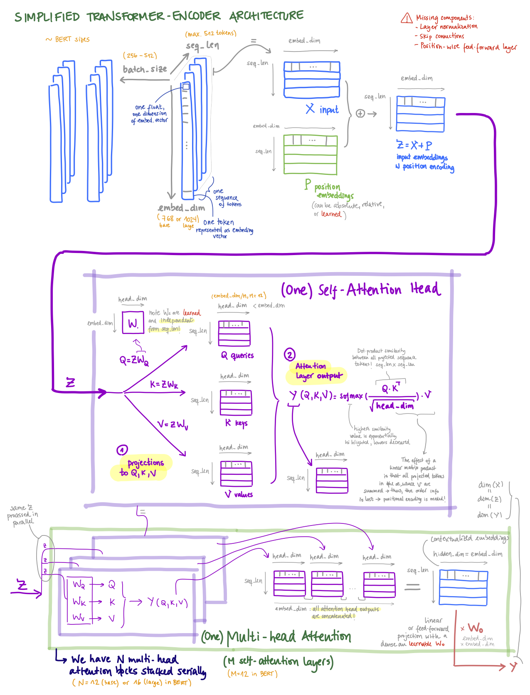

# Natural Language Processing with Transformers: My Notes

These are my personal notes (summary + drawings) of the book [Natural Language Processing with Transformers, by Lewis Tunstall, Leandro von Werra and Thomas Wolf (O'Reilly)](https://www.oreilly.com/library/view/natural-language-processing/9781098136789/).


This repository is a fork of the [official book repository](https://github.com/nlp-with-transformers/notebooks). I modified the notebook contents and moved the original `README.md` to [README_ORG.md](README_ORG.md).

Some related repositories of mine:

- My personal notes on the O'Reilly book [Generative Deep Learning, 2nd Edition, by David Foster](https://github.com/mxagar/generative_ai_book)
- My personal notes on the [Udacity Generative AI Nanodegree](https://github.com/mxagar/generative_ai_udacity)
- My personal guide on [Hugging Face](https://github.com/mxagar/tool_guides/tree/master/hugging_face)
- My personal guide on [LangChain](https://github.com/mxagar/tool_guides/tree/master/langchain)
- Some personal tools for working with [LLMs](https://github.com/mxagar/tool_guides/tree/master/llms)

Table of contents:

- [Natural Language Processing with Transformers: My Notes](#natural-language-processing-with-transformers-my-notes)
  - [Setup](#setup)
    - [Colab Setup](#colab-setup)
  - [Chapter 1: Hello Transformers](#chapter-1-hello-transformers)
    - [Key points](#key-points)
    - [Notebook](#notebook)
    - [List of papers](#list-of-papers)
  - [Chapter 2: Text Classification](#chapter-2-text-classification)
    - [Key points](#key-points-1)
    - [Notebook](#notebook-1)
    - [List of papers](#list-of-papers-1)
  - [Chapter 3: Transformer Anatomy](#chapter-3-transformer-anatomy)
    - [Key points](#key-points-2)
      - [The Encoder](#the-encoder)
      - [The Decoder](#the-decoder)
    - [Notebook and Pytorch Implementation (Transformer-Encoder)](#notebook-and-pytorch-implementation-transformer-encoder)
    - [List of papers](#list-of-papers-2)
      - [Popular Transformer Models](#popular-transformer-models)
  - [Chapter 4: Multilingual Named Entity Recognition](#chapter-4-multilingual-named-entity-recognition)
    - [Key points](#key-points-3)
    - [Notebook](#notebook-2)
    - [List of papers](#list-of-papers-3)
  - [Chapter 5: Text Generation](#chapter-5-text-generation)
    - [Key points](#key-points-4)
    - [Notebook](#notebook-3)
    - [List of papers and links](#list-of-papers-and-links)
  - [Chapter 6: Summarization](#chapter-6-summarization)
    - [Key points](#key-points-5)
    - [Notebook](#notebook-4)
    - [List of papers and links](#list-of-papers-and-links-1)
  - [Chapter 7: Question Answering](#chapter-7-question-answering)
    - [Key points](#key-points-6)
    - [Ideas](#ideas)
    - [Notebook](#notebook-5)
    - [List of papers and links](#list-of-papers-and-links-2)
  - [Chapter 8: Making Transformers Efficient in Production](#chapter-8-making-transformers-efficient-in-production)
    - [Key points](#key-points-7)
      - [Knowledge Distillation](#knowledge-distillation)
      - [Quantization](#quantization)
      - [ONNX](#onnx)
      - [Weight Pruning](#weight-pruning)
    - [Notebook](#notebook-6)
    - [List of papers and links](#list-of-papers-and-links-3)
  - [Chapter 9: Dealing with Few to No Labels](#chapter-9-dealing-with-few-to-no-labels)
    - [Key points](#key-points-8)
      - [Zero-shot learning (no labeled data)](#zero-shot-learning-no-labeled-data)
      - [Data Augmentation (few labeled data)](#data-augmentation-few-labeled-data)
    - [Embedding look-up (few labeled data)](#embedding-look-up-few-labeled-data)
      - [Fine-tuning a transformer (a lot of labeld data)](#fine-tuning-a-transformer-a-lot-of-labeld-data)
      - [Few-shot learning (few data)](#few-shot-learning-few-data)
      - [Domain adaptation (a lot of unlabeled data)](#domain-adaptation-a-lot-of-unlabeled-data)
      - [Advanced methods](#advanced-methods)
    - [Notebook](#notebook-7)
    - [List of papers and links](#list-of-papers-and-links-4)
  - [Chapter 10: Training Transformers from Scratch](#chapter-10-training-transformers-from-scratch)
    - [Key points](#key-points-9)
      - [Collecting and processing a large dataset](#collecting-and-processing-a-large-dataset)
      - [Training/preparing an ad-hoc tokenizer](#trainingpreparing-an-ad-hoc-tokenizer)
      - [Training the model on a cluster of GPUs](#training-the-model-on-a-cluster-of-gpus)
      - [Some Sizes](#some-sizes)
    - [Notebook](#notebook-8)
    - [List of papers and links](#list-of-papers-and-links-5)
  - [Chapter 11: Future Directions](#chapter-11-future-directions)
    - [Key points](#key-points-10)
      - [Scaling Laws](#scaling-laws)
      - [Making Self-Attention More Efficient](#making-self-attention-more-efficient)
      - [Multi-Modality](#multi-modality)
    - [List of papers and links](#list-of-papers-and-links-6)
  - [License](#license)

See also:

- [mxagar/tool_guides/hugging_face](https://github.com/mxagar/tool_guides/tree/master/hugging_face)
- [mxagar/generative_ai_udacity](https://github.com/mxagar/generative_ai_udacity)
- [mxagar/generative_ai_book](https://github.com/mxagar/generative_ai_book)
- [mxagar/nlp_guide](https://github.com/mxagar/nlp_guide)
- [mxagar/computer_vision_udacity/CVND_Advanced_CV_and_DL.md](https://github.com/mxagar/computer_vision_udacity/blob/main/03_Advanced_CV_and_DL/CVND_Advanced_CV_and_DL.md)
- [mxagar/deep_learning_udacity/DLND_RNNs.md](https://github.com/mxagar/deep_learning_udacity/blob/main/04_RNN/DLND_RNNs.md)

## Setup

I used Google Colab, so no setup was needed apart from the local installations in each notebook.

### Colab Setup

The following lines need to be added and modified in each notebook.

```python
# Uncomment and run this cell if you're on Colab or Kaggle
!git clone https://github.com/mxagar/nlp_with_transformers_nbs.git
%cd nlp_with_transformers_nbs
from install import *
install_requirements(is_chapter2=False) # or other chapters...

# Log in to HF with HF_TOKEN
from huggingface_hub import notebook_login
notebook_login()
```

Check the [`install.py`](./install.py) file to see what's happening with the `install_requirements` function.

## Chapter 1: Hello Transformers

### Key points

- Two major papers that led to the rise of the Transformers in NLP
  - Attention is all you need (Vaswani, 2017): Transformer model
    - Encoder-decoder architecture.
    - Self-attention to replace LSTMs, so that sequential tasks are parallelizable.
  - ULMFiT (Howard, 2017): a language model trained on a large corpus can be re-adapted for smaller corpora and other downstream tasks.
    - Transfer learning was validated also for NLP; until then, only worked in CV.
- After those papers, the two most important models were published:
  - GPT: decoder, generative model.
  - BERT: encoder.
- Encoder-decoder framework
  - Before the transformers, LSTMs were SOTA.
  - LSTMs have a hidden state which accumulates previous inputs.
  - Encoder-decoder architectures 
    - Enconder would receive an sequence of words, pass it one-by-one through the LSTM layers and obtain a final hidden state.
    - The final hidden state which would be the seed for the decoder, which would consists again of LSTM layers that would produce an output sequence.
    - That way, sequence-to-sequence tasks can be carried out, e.g., language translation or summarization.
        
    - Problems:
      - (1) Hidden state after a long sequence forgets beginning.
      - (2) We need to pass the words of the sequence one by one.
    - Solutions:
      - (1) Attention was developed (Bahdanau, 2014) and applied: attention layers learn to apply relevance weights of values/vectors; thus, instead of taking the last hidden state, it is possible to take all intermediate hidden states and apply later attention to them.
      - (2) Transformer architecture (Viswani, 2017) does not have LSTMs but MLPs which support processing the complete sequence all at once. It additionally has *self-attention*.
        
- Transfer Learning
  - Common in Computer Vision, but it was shown to work by ULMFiT (Howard, 2017).
    - In CV, fine-tuned models (body/backbone + head) work better than models trained from-scratch.
    - A work related to ULMFiT: ELMo.
  - The ULMFiT framework (they used LSTMs and the *predict-next-word* task, aka. **language modeling**):
    - Pretraining: language modeling (i.e., predict next word) with Wikipedia (large corpus).
    - Domain adaptation: language modeling (i.e., predict next word) with IMDB dataset (small corpus).
    - Fine-tuning: model is fine-tuned for a new downstream task using the adaptation dataset (IMDB), sentiment classification of moview reviews.
- First new models after Transformers were discovered:
  - GPT: decoder, generative. Trained on BookCorpus.
  - BERT: encoder. Trained on BookCorpus. Masked language modeling, predicting the masked word in a test, e.g. *I looked at my [MASK] and saw that it was late*.
- HuggingFace Transformers; examples with `pipeline`: a message to Amazon requesting the correct order is shown, and several models applied:
  - Text classification (sentiment, multi-class, multi-label)
  - Named Entity Recognition (NER): persons, locations, organizations, brands, etc.
  - Question answering: extractive QA, answers provided and location in text used for formulating answer.
  - Summarization.
  - Translation (to German).
  - Text generation: answer from Amazon is generated.
- Tools from Hugging Face:
  - Hub: Models, Datasets, Metrics
  - Libraries: Tokenizers (Rust backend), Transformers (compatible with Pytorch and Tensorflow), Datasets (compatible with Pandas and Numpy), Accelerate (abstraction of training loops for faster deployment).

### Notebook

[`01_introduction.ipynb`](./01_introduction.ipynb):

- Pipelines
- Text classification
- Named Entity Recognition
- Question Answering
- Summarization
- Translation
- Text Generation

### List of papers

- Encoder-decoder (Cho, 2014): [Learning Phrase Representations using RNN Encoder-Decoder for Statistical Machine Translation](https://arxiv.org/abs/1406.1078)
- Attention (Bahdanau, 2014): [Neural Machine Translation by Jointly Learning to Align and Translate](https://arxiv.org/abs/1409.0473)
- Transformer (Vaswani, 2017): [Attention Is All You Need](https://arxiv.org/abs/1706.03762)
- ULMFiT (Howard, 2018): [Universal Language Model Fine-tuning for Text Classification](https://arxiv.org/abs/1801.06146)
- ELMo (Peters, 2018): [Deep contextualized word representations](https://arxiv.org/abs/1802.05365)
- GPT (Radford, 2018): [Improving Language Understanding by Generative Pre-Training](https://cdn.openai.com/research-covers/language-unsupervised/language_understanding_paper.pdf)
- BERT (Devlin, 2018): [BERT: Pre-training of Deep Bidirectional Transformers for Language Understanding](https://arxiv.org/abs/1810.04805)

## Chapter 2: Text Classification

In this chapter the DistilBERT model is adapted and fine-tuned to perform tweet text classification (6 emotions detected); all the NLP pipeline is thoroughly explained. Recall that DistilBERT is originally trained to predict a masked word in a sequence.

### Key points

The complete chapter is about the implementation of the notebook [`02_classification.ipynb`](./02_classification.ipynb). Unfortunately, the notebook does not work right away due to versioning issues. However, I wrote down the most important insights.

A distilled BERT model is taken (encoding transformer) and a classifier is used with it. This classifier is used to predict 6 emotions in a dataset consisting of tweets. The model is trained in two ways:

- The embedding vectors are used to train a logistic regression model; poor performance.
- A classifier head is attached to the transformer and all the weights are trained; i.e., we perform fine-tuning. The performance is much better.

Finally, we can push the weights of the trained model to Hugging Face.

Key points:

- DistilBERT: a distilled version of BERT, much smaller (faster), but similar performance.
- Dataset: `"dair-ai/emotion"`. Six emotions assigned to tweets: `anger, love, fear, joy, sadness, surprise`.
  - **Note**: I could not download the dataset with the provided versions; I did not spend much time fixing the issue...
- We can `list_datasets`.
- We can `load_dataset` given its identifier string.
  - Then, the dataset is a dictionary which contains the keys `"train"` and `"test"`.
  - Each row is a dictionary, because the values are columnar, using Apache Arrow.
  - It is also possible to load CSV or other/similar files using `load_dataset`.
  - Dataset objects can be converted to Pandas with `.set_format(type="pandas")`.
- EDA with the dataset
  - The dataset seems highly imbalanced, but we leave it so.
  - Tweet length vs emotion is plotted in box plots.
  - Later, hex-plots are performed with text embeddings for each emotion. The embeddings are mapped to 2D using UMAP.
- Tokenization and numericalization (`token2id` dictionary)
  - Character tokenization: split by character
    - Simplest scheme, smallest vocabulary size.
    - Problem: words need to be learned from characters.
  - Word tokenization: split by white spaces.
    - Usually, stemming and lemmatizaton are also applied to reduce number of tokens.
    - Much larger vocabulary size.
    - Unknown tokens/words are mapped to `UNK` token.
    - Large vocabularies require many weights in the NN
  - **Subword tokenization**: words are split, combining the best features of the previous two.
    - We can deal with misspellings
    - It is learned from a pretraining corpus.
    - Many subword tokenizers; **WordPiece** used by BERT and DistilBERT.
  - `AutoTokenizer` provides the correct tokenizer for each model; we can also manually instantiate the proper tokenizer for our model (e.g., `DistilBertTokenizer`).
  - Common methods of the tokenizer:
    ```python
    tokenizer = AutoTokenizer.from_pretrained("distilbert-base-uncased")
    encoded_text = tokenizer(text)
    tokens = tokenizer.convert_is_to_tokens(encoded_text.input_ids)
    tokenizer.vocab_size # 30k
    tokenizer.model_max_length # 512, context size
    ```
  - Common features of the used subword tokenizer:
    - Words are split in endings and `##` is appended to the suffixes: `tokenizing -> token, ##izing`.
    - Special tokens are defined: `[PAD], [UNK] (unknown), [CLS] (start), [SEP] (end), [MASK]`.
    - We tokenize the entire dataset by padding if sequence is shorter and truncating otherwise.
    - The output ids have a value `attention_mask`, which is `1` usually, `0` if the token is padded.
    - To tokenize the entire dataset, we define a `tokenize()` function and `map()` it to the dataset.
- Approach 1: Transformers as feature extractors
  - Token embeddings are generated and saved as a dataframe.
    - The selected embeddings are the hidden states from the transformer; for classification, the hidden states of the first token `[CLS]`.
    - We can see that the dimension of the output vector is `(batch_size, seq_len, hidden_size)`; the `hidden_size = 768`.
  - Then, a separate model is trained with the dataframes: logistic regression (choice in the chapter), random forest, XGBoost, etc.
  - The baseline of the classification is the random `DummyClassifier` from Scikit-Learn. Always do this! It is helpful in imbalanced multi-classes cases.
  - The result is a score of 63% (F1); the confusion matrix shows the miss-classifications.
- Approach 2: Add a classification head and fine-tune everything.
  - A classification head which is differentiable is added; that can be done automatically with `AutoModelForSequenceClassification`, for which we specify `num_labels = 6`.
  - We train everything with a `Trainer` instance, which takes:
    - `TrainingArguments`: a class with hyperparameters
    - A custom defined `compute_metrics` function; it receives a `EvalPrediction` object and returns a dictionary with the metric values.
    - The train and eval datasets
    - The `tokenizer`
  - After training, we can `trainer.predict()`: 91% (F1), much better!
  - Error analysis: if we pass a validation split to the `predict` method, we get the loss of each observation, thus, we can list the mis-predictions by loss. Then, we perform an error analysis to detect:
    - Wrong labels.
    - Quirks of the dataset: spacial characters can lead to wrong classifications, maybe we discover new ways of cleaning the data, etc.
    - Similarly, we should look at the samples with the lowest losses.
- Interoperability between frameworks: in some cases the weights of some models are in Pytorch and we'd like to have them in Tensorflow; we can do that using Hugging Face.
- It is also possible to train with Keras.
- We can push the weights of the trained model using `trainer.push_to_hub()`.
- We need to log in to Hugging Face.

### Notebook

[`02_classification.ipynb`](./02_classification.ipynb)

Unfortunately, the notebook does not work right away due to versioning issues.
However, I wrote down the most important insights in the section before.

### List of papers

- DistilBERT (Sanh, 2019): [DistilBERT, a distilled version of BERT: smaller, faster, cheaper and lighter](https://arxiv.org/abs/1910.01108)

## Chapter 3: Transformer Anatomy

This chapter explains the architecture of the transformer.

### Key points

The original Transformer architecture (Vaswani et al., 2017) is based on the **encoder-decoder** architecture:

- The encoder converts input sequence (tokens) into embedding vectors, i.e., **hidden states** or **context**.
- The decoder converts those hidden states into an output sequence.


The original model was used for translation tasks, i.e., from an input sequence in a language to the output sequence in another language. However, the original architecture was quickly split into 3 families:

- Encoder-only: convert input sequence into an embedding that can be used in downstream tasks (classification, etc.).
  - Examples: BERT, DistilBERT, RoBERTa
  - Training is done with masked tokens, thus, left and right parts of a token are used to compute the representation, i.e., **bi-directional attention**.
- Decoder-only: autocomplete a sequence by predicting the most probable next word/token.
  - Example: GPT
  - Training is done to predict next word, so only the left pert of a token is used, aka. **causal or autoregressive attention**.
- Encoder-decoder: from sequence to sequence.
  - Examples: BART, T5.

Some other features of the architecture:

- The line between the 3 branches is a bit blurry: decoders can also translate and encoders can also summarize!
- The components of the architecture are quite simple; we have blocks that contain:
  - Attention layers: similarities of the tokens in the sequence are computed simultaneously (i.e., dot product) and used to weight and sum the embeddings in successive steps.
  - Feed-forward layers: linear transformations of embeddings.
  - Positional embeddings/encodings: since the transformed embeddings are continuously the sum of weighted embeddings, we need to add the lost position information somehow; that can be achieved in different ways using positional embeddings.
  - Normalization
- Both the encoder and the decoder use similar blocks; however
  - The encoder transforms embeddings in successive steps to produce the output embeddings.
  - The decoder takes the output embeddings from the encoder as well as some hidden states and generates a new sequence, which is finished when the `EOS` token (end-of-sentence) emerges.

#### The Encoder

Components (in order):

- **Embedding layer**: tokens are converted into vectors; BERT, `embed_dim = 768 (base) or 1024 (large)`.
- **Positional embeddings/encodings** are added: since the attention layer computes a weighted sum of all tokens in the sequence, we need to encode the position of the tokens. There are several ways:
  - Learnable positional embeddings (applied in the examples here): a learnable embedding layer is added; this is the most popular approach nowadays if the dataset is large enough.
  - Absolute positional representations (original paper): static patterns consisting of modulates sine/cosine patterns; useful for small datasets.
  - Relative positional representations: the attention mechanism is modified incorporating the relative embedding positions.
- `Nx` encoder blocks stacked serially; BERT, N = 12 (base) or 24 (large).  
  One **encoder block** has:
    - **Multi-head self attention + Concatenation + Feed-forward**.
    - Each multi-head attention layer has M self-attention heads; BERT, M = 12 (base) or 16 (large).
      - Each **(self-)attention head** decomposes the input embedding sequences into M sequences that are later concatenated again to form an updated embedding. After decomposition, hidden embedding sequences are created, upon which self-attention is applied:
        - We transform the original embedding into Q (query), K (key), V (value). The transformation is performed by a linear/dense layer, which is learned.
          - Q: ingredients in a recipe are the queries.
          - K: the shelf-labels in the supermarket are the keys; they need to match: similarity function.
          - V: the item in the shelf is the value.
        - Q and K are used to compute a similarity score between token embedding against token embedding (dot product).
        - The similarity is used as a weight to sum all token embeddings from V to yield a new set of hidden embeddings. These are called **contextualized embeddings**, because they contain context information, i.e., the information of the surrounding embeddings. These updates and context integration solves issues like homonyms or difference in word order between different languages.

The attention block is called *self-attention block* because all attention/similarity weights are computed simultaneously for the entire sequence using only the embeddings themselves. In contrast, for RNNs, the attention is computed calculating the relevance of a encoder hidden state wrt. the decoder hidden state, sequentially. Here everything happens simultaneously and in the encoder.

The output embeddings from each encoder block have the same size as the input embeddings, so the encoder block stack has the function of updating those embeddings. This is the summary of the sizes:

- Input embedding sequence: `(batch_size, seq_len, embed_dim)`.
- Embeddings being transformed inside a self-attention layer: `(batch_size, seq_len, head_dim = embed_dim / M)`.
- Embeddings being transferred from one multi-head block to another: `(batch_size, seq_len, hidden_dim = embed_dim)`.



In addition to the already mentioned components, each encoder block has also:

- Layer normalization: inputs/outputs are normalized to mean 0, std 1. This normalization can be pre-layer (original) or post-layer (most common nowadays).
- Skip connections: previous embeddings (before transformations/updates) are added. These skip/residual connections
  - Minimize the gradient vanishing problem.
  - Enable deeper networks.
  - Improve the optimization of the loss function.
- Positional feed-forward layer: two linear/dense matrices (followed by a dropout) further transform the embeddings. Usually, 
  - the first transformation increases 4x the size of the embeddings 
  - and the second scales back the embeddings to their original size.


Finally, if we want to use the encoder stand-alone, we can add a classification head to it; traditionally, the first token in the output hidden embedding sequence is used as the input for the classification. If don't what to perform classification, we can add the decoder to it.

#### The Decoder

The original Transformer was conceived for language translation:

- The Encoder receives the input sequence (e.g., text in English).
- The Decoder produces an output sequence (e.g., text in French).

However, we can also only train the Decoder, for instance, to generate a new text, which is done predicting the next word iteratively: we take every step the so far predicted sequence and input it to the decoder again. That's why such systems are called **auto-regressive**.

If we consider the **full Transformer** (Encoder-Decoder, e.g., for language EN-FR translation), the Decoder takes:

- `K` and `V` from the last Encoder block: these are basically the final hidden states of the processed input sequence (e.g., English text).
- During training, the embeddings of the target sequence are fed (e.g., French text) shifted one token to the right, i.e., one word/token less and `<start>` as initial token.
  - During inference, the only input target sequence is the first token `<start>`.
- Positional embeddings of the target sequence, as for the Encoder.

The Decoder consists of `Nx` blocks (the original paper had 6, GPT-3 has 96, LLama-2 has 32/40/80). The building elements of the Decoder are very similar to the Encoder (see original architecture diagram), but attention layers are slightly different:

- It has a **Masked multi-head self-attention layer**: the tokens of the future time-steps are masked, i.e., set to be zero (if probabilities, or `-inf` if logits), so that the decoder is able to learn only from the past tokens/embeddings (otherwise, it could cheat). The implementation is very simple, and its carried out in the `scaled_dot_product_attention` function from the implementation below.
- It has an **Encoder-decoder attention layer**: `Q` is computed from the Decoder embeddings, but `K` and `V` come from the Encoder. This way, the Decoder learns to relate two sequences. Note that:
  - The `K` and `V` of the final Encoder step/block are used in each Decoder step/block; so `K` and `V` are "frozen", i.e., the same for all steps.
  - The `Q` is computed in the Decoder for every new step/block; `Q` refers to the sequence generated so far, while `K` and `V` refer to the original sequence.
  - Unlike in the Encoder, the `Q, K, V` matrices can have different sizes, so the attention scores matrix can be rectangular.


Note that in sequence-to-sequence models usually **Teacher forcing** is used, which involves using the actual target output (the ground truth) from the training data as the input to the next time step in the sequence, rather than using the model's own predicted output from the previous time step.

### Notebook and Pytorch Implementation (Transformer-Encoder)

In the following, a simple implementation of the **Transformer-Encoder** is provided: [`transformer_encoder.py`](./transformer_encoder.py). It is based on the code provided in the notebook [`03_transformer-anatomy.ipynb`](./03_transformer-anatomy.ipynb).

For an example implementation of the **Transformer-Decoder**, see [minGPT by Karpathy](https://github.com/karpathy/minGPT).

```python
"""This is a very simple implementation
of the Transfomer-Encoder, following the
book

    Natural Language Processing with Transformers
    
by Tunstall et al.

Dependencies:
- transformers
- torch

The configuration class from AutoConfig is the following:

    BertConfig {
    "_name_or_path": "bert-base-uncased",
    "architectures": [
        "BertForMaskedLM"
    ],
    "attention_probs_dropout_prob": 0.1,
    "classifier_dropout": null,
    "gradient_checkpointing": false,
    "hidden_act": "gelu",
    "hidden_dropout_prob": 0.1,
    "hidden_size": 768,
    "id2label": {
        "0": "LABEL_0",
        "1": "LABEL_1",
        "2": "LABEL_2"
    },
    "initializer_range": 0.02,
    "intermediate_size": 3072,
    "label2id": {
        "LABEL_0": 0,
        "LABEL_1": 1,
        "LABEL_2": 2
    },
    "layer_norm_eps": 1e-12,
    "max_position_embeddings": 512,
    "model_type": "bert",
    "num_attention_heads": 12,
    "num_hidden_layers": 12,
    "pad_token_id": 0,
    "position_embedding_type": "absolute",
    "transformers_version": "4.16.2",
    "type_vocab_size": 2,
    "use_cache": true,
    "vocab_size": 30522
    }
"""
import torch
from math import sqrt
from torch import nn
from transformers import AutoConfig
from transformers import AutoTokenizer


def scaled_dot_product_attention(query, key, value, mask=None):
    """Attention is implemented here.
    It is called self-attention because we use only the encoder hidden states
    to compute all similarities between tokens in the sequence simultaneously.
    That means, no decoder hidden states are used. The output is a set of
    contextualized embeddings, i.e., a weighted sum of all the embeddings,
    which captures the context information."""
    dim_k = query.size(-1)
    # Batch matrix-matrix product
    scores = torch.bmm(query, key.transpose(1, 2)) / sqrt(dim_k)
    if mask is not None:
        # This masked option is for the Decoder part
        # not the Encoder. We can create a bottom-triangular matrix
        # with 1s (bottom part) and 0s (upper part) as follows:
        # mask = torch.tril(torch.ones(seq_len, seq_len)).unsqueeze(0)
        scores = scores.masked_fill(mask == 0, float("-inf"))
    weights = F.softmax(scores, dim=-1)
    # This matrix multiplication produces a weighted sum of all value vectors
    # which is a set of contextualized embeddings
    return weights.bmm(value)


class AttentionHead(nn.Module):
    """Self-attention head."""
    def __init__(self, embed_dim, head_dim):
        super().__init__()
        self.q = nn.Linear(embed_dim, head_dim)
        self.k = nn.Linear(embed_dim, head_dim)
        self.v = nn.Linear(embed_dim, head_dim)

    def forward(self, hidden_state):
        attn_outputs = scaled_dot_product_attention(
            self.q(hidden_state), self.k(hidden_state), self.v(hidden_state))
        return attn_outputs


class MultiHeadAttention(nn.Module):
    """It combines several attention heads (M = 12 in BERT base).
    Orange block in the original paper diagram."""
    def __init__(self, config):
        super().__init__()
        embed_dim = config.hidden_size
        num_heads = config.num_attention_heads
        head_dim = embed_dim // num_heads
        self.heads = nn.ModuleList(
            [AttentionHead(embed_dim, head_dim) for _ in range(num_heads)]
        )
        self.output_linear = nn.Linear(embed_dim, embed_dim)

    def forward(self, hidden_state):
        x = torch.cat([h(hidden_state) for h in self.heads], dim=-1)
        x = self.output_linear(x)
        return x


class FeedForward(nn.Module):
    """Often called Positional Feed-Forward layer.
    Blue block in the original paper diagram."""
    def __init__(self, config):
        super().__init__()
        # The intermediate_sie is often 4x the hidden_size = embed_dim
        self.linear_1 = nn.Linear(config.hidden_size, config.intermediate_size)
        self.linear_2 = nn.Linear(config.intermediate_size, config.hidden_size)
        self.gelu = nn.GELU()
        self.dropout = nn.Dropout(config.hidden_dropout_prob)
        
    def forward(self, x):
        x = self.linear_1(x)
        x = self.gelu(x)
        x = self.linear_2(x)
        x = self.dropout(x)
        return x
    

class TransformerEncoderLayer(nn.Module):
    """This class is a single encoder block which contains
    
    - a multi-head attention layer (with several attention heads + a linear layer),
    - normalization layers (inputs in the batch are transformed to have zero mean and unity variance),
    - a positional feed-forward layer,
    - and skip connections (to avoid gradient vanishing and enable deeper networks).
    
    This block is the grayed block in the original paper diagram,
    repeated Nx, being in BERT N = 12 (base) or 16 (large).
    
    Note that the arrangement in which we apply layer normalization and skip connections
    might vary:
    
    - Post-layer normalization (original paper): trickier to train.
    - Pre-layer normalization (most common now, applied here): more stable during training.
    """
    def __init__(self, config):
        super().__init__()
        self.layer_norm_1 = nn.LayerNorm(config.hidden_size)
        self.layer_norm_2 = nn.LayerNorm(config.hidden_size)
        self.attention = MultiHeadAttention(config)
        self.feed_forward = FeedForward(config)

    def forward(self, x):
        # Apply layer normalization and then copy input into query, key, value
        hidden_state = self.layer_norm_1(x)
        # Apply attention with a skip connection
        x = x + self.attention(hidden_state)
        # Apply feed-forward layer with a skip connection
        x = x + self.feed_forward(self.layer_norm_2(x))
        return x


class Embeddings(nn.Module):
    """This layer creates the embeddings from token input ids.
    It is applied only in the beginning.
    In addition, positional embeddings are added here, too; these are needed
    because the attention layer computes a weighted sum of all token embeddings,
    so the outputs loose the positional information.
    
    There are several ways to add positional information:
    
    - Learnable positional embeddings (applied here): a learnable embedding layer
    is added; this is the most popular approach nowadays if the dataset is large enough.
    - Absolute positional representations (original paper): static patterns
    consisting of modulates sine/cosine patterns; useful for small datasets.
    - Relative positional representations: the attention mechanism is modified incorporating
    the relative embedding positions.
    """
    def __init__(self, config):
        super().__init__()
        self.token_embeddings = nn.Embedding(config.vocab_size, 
                                             config.hidden_size)
        self.position_embeddings = nn.Embedding(config.max_position_embeddings,
                                                config.hidden_size)
        self.layer_norm = nn.LayerNorm(config.hidden_size, eps=1e-12)
        self.dropout = nn.Dropout()

    def forward(self, input_ids):
        # Create position IDs for input sequence
        seq_length = input_ids.size(1)
        position_ids = torch.arange(seq_length, dtype=torch.long).unsqueeze(0)
        # Create token and position embeddings
        token_embeddings = self.token_embeddings(input_ids)
        position_embeddings = self.position_embeddings(position_ids)
        # Combine token and position embeddings
        embeddings = token_embeddings + position_embeddings
        embeddings = self.layer_norm(embeddings)
        embeddings = self.dropout(embeddings)
        return embeddings


# This is the Transformer-Encoder without any downstream/task head
# We need to pass to it a tensor with token ids, so the tokenization
# and the vocabulary need to be generated.
class TransformerEncoder(nn.Module):
    """The final but task-less Transformer-Encoder."""
    def __init__(self, config):
        super().__init__()
        self.embeddings = Embeddings(config)
        self.layers = nn.ModuleList([TransformerEncoderLayer(config) 
                                     for _ in range(config.num_hidden_layers)])

    def forward(self, x):
        x = self.embeddings(x)
        for layer in self.layers:
            x = layer(x)
        return x


# This is the Transformer-Encoder with a classification task head
class TransformerForSequenceClassification(nn.Module):
    """The final Transformer-Encoder with a classification task."""
    def __init__(self, config):
        super().__init__()
        self.encoder = TransformerEncoder(config)
        self.dropout = nn.Dropout(config.hidden_dropout_prob)
        self.classifier = nn.Linear(config.hidden_size, config.num_labels)
        
    def forward(self, x):
        x = self.encoder(x)[:, 0, :] # select hidden state of [CLS] token
        x = self.dropout(x)
        x = self.classifier(x)
        return x


if __name__ == "__main__":

    model_ckpt = "bert-base-uncased"
    text = "time flies like an arrow"

    # We need to tokenize our inputs to ids to pass them to the transformer
    tokenizer = AutoTokenizer.from_pretrained(model_ckpt)
    # The configuration class contains many parameters,
    # it's like a dictionary which contains all of them together
    # and the code is much cleaner
    config = AutoConfig.from_pretrained(model_ckpt)

    # Here, special tokens as CLS and SEP as excluded for simplicity
    inputs = tokenizer(text, return_tensors="pt", add_special_tokens=False)
    # inputs.input_ids: tensor([[ 2051, 10029,  2066,  2019,  8612]])
    token_emb = nn.Embedding(config.vocab_size, config.hidden_size)
    # Embedding(30522, 768)
    inputs_embeds = token_emb(inputs.input_ids)
    # torch.Size([1, 5, 768]): (batch_size, seq_len, hidden_size = embed_dim)
    
    multihead_attn = MultiHeadAttention(config)
    attn_outputs = multihead_attn(inputs_embeds)    
    # torch.Size([1, 5, 768]): (batch_size, seq_len, hidden_size = embed_dim)
    
    feed_forward = FeedForward(config)
    ff_outputs = feed_forward(attn_outputs)
    # torch.Size([1, 5, 768]): (batch_size, seq_len, hidden_size = embed_dim)
    
    encoder_layer = TransformerEncoderLayer(config)
    # torch.Size([1, 5, 768]): (batch_size, seq_len, hidden_size = embed_dim)
    
    embedding_layer = Embeddings(config)
    # torch.Size([1, 5, 768]): (batch_size, seq_len, hidden_size = embed_dim)
    
    # This is the Transformer-Encoder without any downstream/task head
    # We need to pass to it a tensor with token ids, so the tokenization
    # and the vocabulary need to be generated.
    encoder = TransformerEncoder(config)
    outputs = encoder(inputs.input_ids)
    # torch.Size([1, 5, 768]): (batch_size, seq_len, hidden_size = embed_dim)

    # This is the Transformer-Encoder with a classification task head
    config.num_labels = 3
    encoder_classifier = TransformerForSequenceClassification(config)
    classes = encoder_classifier(inputs.input_ids)
    # torch.Size([1, 3]): (batch_size, num_labels)
```

### List of papers

- Transformer (Vaswani et al., 2017): [Attention Is All You Need](https://arxiv.org/abs/1706.03762)
- ELMo Contextualized embeddings (Peters et al., 2018): [Deep Contextualized Word Representations](https://arxiv.org/abs/1802.05365)
- GLUE Benchmark (Wang et al., 2018): [GLUE: A Multi-Task Benchmark and Analysis Platform for Natural Language Understanding](https://arxiv.org/abs/1804.07461)

#### Popular Transformer Models

- Encoder-only: sequence-to-embeddings.
  - BERT (Devlin et al., 2018 - Google): [BERT: Pre-training of Deep Bidirectional Transformers for Language Understanding](https://arxiv.org/abs/1810.04805)
    - Outperformed GLU: Natural Language Understanding (NLU) benchmark.
    - Trained with two goals: predict masked word, predict if one text passage follows another.
  - DistilBERT (Sanh et al., 2019 - HuggingFace): [DistilBERT, a distilled version of BERT: smaller, faster, cheaper and lighter](https://arxiv.org/abs/1910.01108)
    - 97% of BERT's performance, but 40% less memory and 60% faster.
  - RoBERTa (Liu et al., 2019 - Meta/Facebook): [RoBERTa: A Robustly Optimized BERT Pretraining Approach](https://arxiv.org/abs/1907.11692)
    - Performance of BERT improved by changing the training scheme.
  - XLM (Lample et al., 2019 - Meta/Facebook): [Cross-lingual Language Model Pretraining](https://arxiv.org/abs/1901.07291)
- Decoder-only: sequence generation.
  - GPT (OpenAI): next word prediction.
    - GPT-1 (Radford et al., 2018): [Improving Language Understanding by Generative Pre-Training](https://openai.com/index/language-unsupervised/)
    - GPT-2 (Radford et al., 2019): [Language Models are Unsupervised Multitask Learners](https://openai.com/index/better-language-models/)
    - GPT-3 (Brown et al., 2020): [Language Models are Few-Shot Learners](https://arxiv.org/abs/2005.14165)
      - Power laws govern the relation between compute, dataset size, model size and performance.
      - 175 billion parameters.
      - Few-shot learning.
  - Llama (Meta/Facebook)
    - Llama 1 (Touvron et al., 2023): [LLaMA: Open and Efficient Foundation Language Models](https://arxiv.org/abs/2302.13971)
    - Llama 2 (Touvron et al., 2023): [Llama 2: Open Foundation and Fine-Tuned Chat Models](https://arxiv.org/abs/2307.09288)
    - Llama 3 (Dubey et al., 2024): [The Llama 3 Herd of Models](https://arxiv.org/abs/2407.21783)
  - Mixtral (Jiang et al., 2024 - Mistral): [Mixtral of Experts](https://arxiv.org/abs/2401.04088)
  - Phi-1 (Gunasekar et al., 2023 - Microsoft): [Textbooks Are All You Need](https://arxiv.org/abs/2306.11644)
- Encoder-Decoder: sequence-to-sequence.
  - BART (Lewis et al., 2029 - Meta/Facebook): [BART: Denoising Sequence-to-Sequence Pre-training for Natural Language Generation, Translation, and Comprehension](https://arxiv.org/abs/1910.13461)
  - T5 (Raffel et al., 2019 - Google): [Exploring the Limits of Transfer Learning with a Unified Text-to-Text Transformer](https://arxiv.org/abs/1910.10683)
    - Original Transformer architecture.
    - All tasks framed as text-to-text, even classification is possible by producing a label text.
  - Big Bird (Zaheer et al., 2020 - Google): [Big Bird: Transformers for Longer Sequences](https://arxiv.org/abs/2007.14062)
    - Context size increases quadratically memory, because attention is a matrix.
    - Big Bird uses a sparse attention which scales linearly.

## Chapter 4: Multilingual Named Entity Recognition

This chapter shows:

- How a head can be manually defined to a transformer-encoder body.
- Fine-tuning of models for token classification, i.e., NER (Named Entity Recognition)
- How a multi-lingual backbone can be fine-tuned for a mono-lingual task/dataset, but still works for languages it wasn't trained for.

### Key points

- Definitions
  - *Zero-shot cross-lingual transfer* = a model which is fine-tuned on one language can be applied to others without further training.
    - *Zero-shot* also refers to the cases where the training and test/evaluation labels are different.
  - NER: Named Entity Recognition = detect special names, like
    - Organization: `ORG`
    - Person: `PER`
    - Location: `LOC`
- **Used dataset: PAN-X**, a subset of XTREME: Cross-lingual transfer evaluation of multilingual encoders; it contains text from Wikipedia articles in many languages.
  - 7 classes:
    - `B-ORG`, `I-ORG`: begin and continue organization tokens
    - `B-PER`, `I-PER`: begin and continue person tokens
    - `B-LOC`, `I-LOC`: begin and continue location tokens
    - `0`: token doesn't belong to any entity
  - Subset of used languages: the ones in Switzerland: German `de`, French `fr`, Italian `it`, English `en`; also, the balance percentages are adjusted to the usage in Switzerland.
  - We check that the number of entity classes is balanced, too.
  - The initial fine-tuning is performed only for German.
- **Used model: XLM-RoBERTa (XLM-R)**; same architecture as BERT, but training scheme is different. Good choice for multi-lingual NLU tasks (Natural Language Understanding).
  - The model is pretrained with 100s of languages.
  - It uses a different tokenizer: SentencePiece (instead of WordPiece).
    - WordPiece has `[CLS]` and `[SEP]` (start and end), and `##` (to denote broken word parts)
    - SentencePiece uses `<s>` and `</s>`, and `▁` (to denote preceding white space); it is better suited to detokenize without ambiguities.
  - Vocabulary size: 250k (instead of 55k).
- Tokenizer pipelines consist of these steps
  - Normalization
    - Clean: strip whitespaces, remove accents
    - Unicode normalization: convert special symbols to unified Unicode
    - Lowercase
  - Pretokenization
    - Split text into smaller objects: usually, words and punctuation
  - Tokenizer model
    - Sub-word splitting: this reduces the vocabulary size and the number of out-of-vocabulary tokens; it is also a way of handling misspellings.
    - This needs to be trained on a corpus.
    - For token classification, as convention in the chapter, if a word is broken into pieces, only the first part is labeled with the proper NER class, and the rest is labeled as ignored `IGN` (default id -100 in Pytorch). After the inference, it is easy to propagate the first predicted class to the subsequent `IGN` tokens.
  - Postprocessing
    - Add special tokens: `[CLS]`, `[SEP]`
- Model architecture: `BertModel` (body: task agnostic) and `BertForTask` (body + head: task-specific)
  - In the *sequence classification* architecture from Chapter 2, the first hidden state of the output sequence (`[CLS]`) was taken and passed to alinear layer which mapped to the desired classes. Now, we want to perform a *token classification*, thus, all the output hidden states of the sequence  are passed each to a linear mapping to classify them (7 classes).
    
  - HF Transformers already has classes for that:
    - `AutoModelFor<Task>`: model class chosen from passed model string.
    - `<Model>For<Task>`, e.g., **`XLMRobertaForTokenClassification`**: the class necessary here.
      - XLM-Roberta is in essence the same architecture as BERT, but it was trained with another setting and dataset
  - However, a class is created maually, for learning purposes; this class implements the head, given the body (XLM-Roberta):
    ```python
    import torch.nn as nn
    from transformers import XLMRobertaConfig
    from transformers.modeling_outputs import TokenClassifierOutput
    from transformers.models.roberta.modeling_roberta import RobertaModel
    from transformers.models.roberta.modeling_roberta import RobertaPreTrainedModel

    # Since inherited from PretrainedModel, we get access to all Transformers utilities!
    class XLMRobertaForTokenClassification(RobertaPreTrainedModel):
        # When initialized, standard XLM-R settings are loaded and used
        config_class = XLMRobertaConfig

        def __init__(self, config):
            super().__init__(config)
            self.num_labels = config.num_labels
            # Load model body
            # add_pooling_layer=False: ensure all hidden states are returned, not only first
            self.roberta = RobertaModel(config, add_pooling_layer=False)
            # Set up token classification head
            self.dropout = nn.Dropout(config.hidden_dropout_prob)
            self.classifier = nn.Linear(config.hidden_size, config.num_labels)
            # Load and initialize weights
            self.init_weights()

        # One forward pass defined
        def forward(self, input_ids=None, attention_mask=None, token_type_ids=None, 
                    labels=None, **kwargs):
            # Use model body to get encoder representations
            outputs = self.roberta(input_ids, attention_mask=attention_mask,
                                  token_type_ids=token_type_ids, **kwargs)
            # Apply classifier to encoder representation
            sequence_output = self.dropout(outputs[0])
            logits = self.classifier(sequence_output)
            # Calculate losses
            loss = None
            if labels is not None:
                # If we provide labels, loss is computed
                loss_fct = nn.CrossEntropyLoss()
                loss = loss_fct(logits.view(-1, self.num_labels), labels.view(-1))
            # Return model output object
            return TokenClassifierOutput(loss=loss, logits=logits, 
                                        hidden_states=outputs.hidden_states, 
                                        attentions=outputs.attentions)
    ```
- Special effort is put in tokenization and alignment
- For evaluation, specific functions are defined using the library `seqeval`
  - We perform sequence evaluation: all tokens in a seuence must be correct for the sequence to be correct.
- Training (fine-tuning)
  - A `TrainingArguments` class is instantiated, as well as a `Trainer`.
  - Additionally, since we'll push the model to HF
    - We need to log in to HF allowing git credentials
    - We need to create a repository in HF (done programmatically)
  - A data collator is used for the batches: the sequences are padded to the largest sequence in the batch
  - After training, the resulting fine-tuned model is pushed to HF: [`mxagar/xlm-roberta-base-finetuned-panx-de`](https://huggingface.co/mxagar/xlm-roberta-base-finetuned-panx-de)
- Error Analysis
  - Evaluation: confusion matrix
    - `B-ORG` and `I-ORG` are confused the most.
  - Look at valiadion samples with the highest loss: sum of all losses for all tokens in the sequence
    - Realization: some labels are wrong!
    - PAN-X is a so called *silver standard* (i.e., labeling was automated), vs *gold standard* datasets (i.e., labeling done by humans).
    - Usually, iterations are done after correcting the labels
- Cross-lingual transfer
  - Recall: XLM-Roberta was trained in 100s of langueges, but we fine-tune only for German.
  - However, the fine-tuned model seems to still work well with unseen languages! This is **zero-shot learning**
    - The transfer result is usually better for languages within the same family.
  - F1 for
    - `de`: 87%
    - `fr`: 70%
    - `it`: 65%
    - `en`: 58%
  - To see when it makes sense to use zero-shot learning, the model is further fine-tuned with subsets of `fr` dataset of increasing amounts and the F1 is computed
    - Result: we get the amount of samples required so that fine-tuning is better than cross-lingual transfer with zero-shot learning
    - This is relevant to decine when to collect and label samples!
- Finally, `de`+`fr` language splits are concatenated and a model is trained with all the languages; better results are achieved, but not only for `de`+`fr`, aslo for `it` and `en`
  - Learning: fine-tuning a cross-lingual for multiple languages improves the performance with other languages, specially from the same family

### Notebook

All the implementation is done in [`04_multilingual-ner.ipynb`](./04_multilingual-ner.ipynb).

There is one issue in the notebook: since the notebook expects to pull/push to an existing repository, we need to create it somehow. We can do that in the notebook as follows:

```python
from huggingface_hub import HfApi

# Since the repository to push to is not created, we need to create one first!
api = HfApi()
# The name of the URL is derived from model_name above, as well as our loging name
# If we are unsure, we can skip this cell, run the next and we'll get the repo
# the Trainer is trying to clone -> we need to copy the repo URL slug and use it here!
# https://huggingface.co/mxagar/xlm-roberta-base-finetuned-panx-de
api.create_repo(repo_id="mxagar/xlm-roberta-base-finetuned-panx-de", private=False)
```

### List of papers

- XTREME Dataset (Hu et al., 2020): [XTREME: A Massively Multilingual Multi-task Benchmark for Evaluating Cross-lingual Generalization](https://arxiv.org/abs/2003.11080)
- XLM-RoBERTa (Conneau et al., 2020): [Unsupervised Cross-lingual Representation Learning at Scale](https://arxiv.org/abs/1911.02116)

## Chapter 5: Text Generation

This chapter does not deal with the decoder part of the Transformer model; instead, two aspects related to the *next-word* sequence generation are introduced:

- Token search during decoding: greedy vs. beam.
- Sampling: temperature, top-k and top-p.

### Key points

- Unexpected feature of the Transformers: they can create text almost undistinguishable from humans.
- Eventhough Transformers are trained without explicit supervision, they learn to carry out zero-shot tasks
  - Simple sums
  - Code generation
  - Missspelling correction
  - Translations
  - etc.
- However, note that related texts must occur usually naturally in the training set.
- Decoding: given an input prompt a word/token is generated, which is concatenated to the input prompt, and the next word is generated iteratively until we obtain an `EOS` token or we reach the maximum amount of tokens.
  - Encoder-Decoder differences:
    - In the encoder, we input the entire sequence to the model and obtain the output sequence in a single pass
    - In the decoder, we need at least one forward pass for each output token: that requires more resources!
    - In the decoder, we have some hyperparameters post-training which affect the generation, related to the search method and the sampling method.
  - In reality, predicting the next token and extending the input sequence in an autoregressive way is a simplification; the formal method would be to predict a tree of all possible token choices, but that is not feasible in practice.
  - Two main decoding or selection strategies are used:
    - **Greedy Search Decoding**: at each step, we select (=decode) the token with the highest probability.
      - It's easy to implement, but we can use the built-in `generate()` method instead, which offers more options.
    - **Beam Search Decoding**: we select an integer value for `b = number_beams`, and keep track of the most probable next tokens building a tree of options. The most likely paths/beams are chosen, ranking the beams with their summed log probabilities.
      - We would take the product of (conditional) probabilities, but since that's too small, we use the equivalent sum of log probabilities.
      - The more beams we choose, the better the quality, but the computational effort explodes.
      - Beam search sometimes suffers from repetitive generation; one way to avoid that is using n-gram penalty, i.e., we penalize the repetition of n-grams.
      - This is commonly used in summarization and machine translation.
- Sampling Methods: for any given decoding/next-word-search strategy, we can decide to sample in different ways; factors that affect here:
  - **Temperature**: we get the token probabilities as output from the generative LLM; if we apply a `softmax` with the inverse of a `Temperature` variable as the exponent, we reshape the token probability distribution (Boltzman distribution):
    - `T >> 1`: small ps get bigger, large ps smaller -> more homogeneous distribution -> more **creativity / diversity**, because any word/token could be chosen.
    - `T = 1`: ps are not changed from the original output.
    - `T << 1`: small ps smaller, large ps larger -> more peaked distribution -> less creativity and more **coherence**, because the most likely words are chosen.
    - We can decide to apply `T` for any decoding strategy or sampling method: greedy/beam search, top-k/p sampling.
  - **Top-k**: instead of considering all tokens each with their p (with or without `T`), we reduce it to the `k` most likely ones and select from them using their distributions.
  - **Nucleus Sampling or Top-p**: instead of making the number `k` of the most likely ones to be considered fixed, we make it dynamic by specifying the cumulated probability threshold from which we cut the less likely tokens off; e.g., `top_k = 0.9`: we consider the first ranking tokens which cumulate up to `p = 0.9`.
    - We can combine `top_k` and `top_p`: usually the `k` are chosen and the cummulative `p` is applied.

### Notebook

All the implementation is done in [`05_text-generation.ipynb`](./05_text-generation.ipynb).

Even though many things are shown in the notebook, the practical lines to generate text are the following:

```python
import torch
from transformers import AutoTokenizer, AutoModelForCausalLM

device = "cuda" if torch.cuda.is_available() else "cpu"
model_name = "gpt2-xl"
tokenizer = AutoTokenizer.from_pretrained(model_name)
model = AutoModelForCausalLM.from_pretrained(model_name).to(device)

# Input text
max_length = 128
input_txt = """In a shocking finding, scientist discovered \
a herd of unicorns living in a remote, previously unexplored \
valley, in the Andes Mountains. Even more surprising to the \
researchers was the fact that the unicorns spoke perfect English.\n\n
"""
input_ids = tokenizer(input_txt, return_tensors="pt")["input_ids"].to(device)

# Run generative model
output = model.generate(
  input_ids,
  max_length=max_length,
  num_beams=5, # Optional, number of beams - otherwise greedy search
  do_sample=True, # Optional, if we'd like to use top_k/p sampling
  temperature=2.0, # Optional, if we'd like t o alter the ps
  top_k=0, # Optional, sampling from k most likely
  top_p=0.90 # Optional, sampling from most likely that cummulate p=90%
)

# Decoded text
print(tokenizer.decode(output[0]))
```

### List of papers and links

- GPT-2 (Radford et al., 2019)[Language Models are Unsupervised Multitask Learners ](https://paperswithcode.com/paper/language-models-are-unsupervised-multitask)
- GPT-2 Code: [`openai/gpt-2`](https://github.com/openai/gpt-2)
- Karpathy's nanoGPT: [`karpathy/nanoGPT`](https://github.com/karpathy/nanoGPT)

## Chapter 6: Summarization

### Key points

- Summarization is classic sequence-to-sequence task: encoder-decoder models are used.
- Dataset: CNN/DailyMail
  - 300k pairs of news articles + summaries composed of original bullet points
  - Summaries are **abstractive**: new sentences.
    - Not **extractive** summaries: excerpts.
  - Columns: `article, highlights, id`.
  - Long articles truncated to 2k characters, due to context size limit (often 1k tokens).
- Text summarization pipeline
  - NLTK is used to separate sentences: `nltk.sent_tokenize()`.
  - A baseline summary is computed by taking the first 3 sentences.
  - Models compared
    - T5: encoder-decoder, it is a *universal* transformer, because it was trained to perform 4 text-to-text tasks depending on the prompt:
      - Translation
      - Summarization
      - Semantic similarity computation (a float value is returned as string)
      - CoLA: Linguistic acceptability (is sentence correct?)
    - BART: encoder-decoder, trained to reconstruct corrupted outputs
    - PEGASUS: encoder-decoder, trained to predict masked sentences in multi-sentence texts.
    - GPTs (decoder) work also! For instance GPT2 produces a summary if we append `TL;DR`. However, the used versions often hallucinate. Note: GPT has not been trained on this task!
- Metrics for generated text
  - **BLEU**: related to **precision**, used in **transalation**.
    - *n-grams* in produced vs. reference text are compared, i.e., number of *n-grams* that appear in the produced text over the number in the reference text (num-produced / num-reference clipped).
      - *n-gram*: n tokens in a predefined sequence; usually 4-grams are used, i.e., first all 1-grams are compared, then, 2-grams, until 4-grams (i.e., all possible 4-token sequences).
    - Some heuristics are applied to the score to account for short generations, clipping, etc.
    - Without heuristics, it's precision.
    - Limitations: heuristics; synonyms are not considered.
    - High **precision** is favoured: all possible appropriate words measured.
  - **ROUGE**: related to **recall**, used in **summarization**.
    - Equivalent to BLEU, but we measure how many produced n-gram occurrences occur in the reference (num-reference / num-produced).
    - ROUGE is the recall of the unclipped BLEU precision.
    - Together with the Precision (BLEU) and Recall (ROUGE) values we can compute the harmonic mean: F1.
    - Along with ROUGE, the **ROUGE-L** is often computed:
      - ROUGE-L: average Longest Common Substring (LCS) ratio.
      - ROUGE-L Sum: LCS over all the summary.
    - Often, the Confidence Interval (95%) is provided.
  - Usually, evaluation functions are defined and used all the time, at different stages.
- The PEGASUS model is evaluated with the CNN/DailyMail dataset; however, note that generating 100 tokens for each sample required 1 million forward passed, thus, 1000 samples are taken only.
- PEGASUS is fine-tuned with the SAMSUm summarization dataset: dialogues (customer support center) + summaries.
  - SAMSum summaries are more abstractive.
  - When using different datasets, it's important to compare their characteristics, e.g., distribution of token length, etc.
  - A data collator is used: an object which usually stacks inputs and prepares the targets.
  - Teacher forcing is used: decoder receives input tokens shifted by one.
  - Gradient accumulation is performed to handle virtual large batches that would not fit in the memory otherwise.
  - Everything (model, data collator / dataset) is passed to the `Trainer`.
- After fine-tuning, PEGASUS' metrics are much better.
- Active research topic: how can we summarize texts which are longer than the context size?

### Notebook

Notebook: [`06_summarization.ipynb`](./06_summarization.ipynb).

The notebook cannot be run on Google Colab that easily due to out-of-memory issues (T4 GPU).

### List of papers and links

- BLEU (Papineni, 2002): [BLEU: a Method for Automatic Evaluation of Machine Translation](https://aclanthology.org/P02-1040.pdf)
- ROUGE (Lin, 2004): [ROUGE: A Package for Automatic Evaluation of Summaries](https://aclanthology.org/W04-1013/)

## Chapter 7: Question Answering

There are many types of QA, e.g.:

- **Extractive** QA: answer is identified in a span of text in a document. This is done here.
- Abstractive or generative QA (Retrieval Augmente Generation).
- Community QA: QA pairs generated in forums.
- Long-form QA: complex paragraph-length answers to open eneded questions like "Why is the sky blue?"
- ...

In extractive QA, we have two steps:

- Retrieval: first, the documents which contain the answer to the question need to be found. The retrieval can be
  - Sparse: inverted indices of tokens, often built using TF-IDF or derivates.
  - Dense: token embeddings; in recent years, semantic embeddings.
- Reading model: a transformer is often used to understand the text and a token classifier is appended as head to identify the start and end tokens.
  - Sometimes the retrieved documents need some kind of re-ranking before being passed to the Reader model.

These two steps usually need each a seprate module; in addition, we often find these extra components in QA system:

- Document store: the database where the documents are stored and retrieved from.
- A pipeline: the component that connects and coordinates all the modules or components.

To build a complete system that coordinates both Retriever and Reader models [Haystack](https://haystack.deepset.ai/) is used.

### Key points

- Dataset: SubjQA: 10k customer reviews in English about products and services in 6 domains: TripAdvisor, Restaurants, Movies, Books, Electronics, Grocery.
  - Relevant aspect of the dataset: QAs are subjective, i.e., they depend on the personal experience and perception of the users.
  - The QA items are organized in domains, so it's easier for the retrieval system to look for them.
  - Used domain: electronics; 2k items in the domain
    - Few, like in real world.
    - Thus, best option is to take a transformer which was already pre-trained on QA datasets.
  - Item properties, i.e., columns:
    - `title`
    - `question`
    - `context`: complete review.
    - `answers.answer_start`: start character in `context` for the answer.
    - `answers.text`: answer span; if empty, unanswerable `question`.
  - Questions are often not grammatically correct.
  - Compute the distribution of question types: how, what, is, do, does, where, why, was?
- Other important datasets: 
  - SQuAD: Stanford Question Answering Dataset, which collects items related to Wikipedia articles; same structure as SubjQA.
  - NQ: Natural Questions Dataset from Google, fact-seeking questions from Google users; more challenging that SQuAD, replacement for it.
- *Span classification* (i.e., a specific *token classification*) is performed on the retrieved documents to predict the start and end tokens.
  
- **Reader**: Since we have few items (2k), we should pick a model which is already pre-trained in QA datasets like SubjQA or SQuAD; choice `deppset/minilm-uncased-squad2` (fast to train).
  - Since the model has a context size of 512, we can use the *sliding window* technique, which creates several chunks for the entire context, each connected with the question.
  - We can activate that with the flag `return_overflowing_tokens` in the tokenizer.
- The Q and the context are tokenized sequentially one after the other.
- Both the `pipeline` and the `AutoModelForQuestionAnswering` are tried.
  - The `AutoModel` returns `QuestionAnsweringModelOutput`, which contains `start_logits` and `end_logits`.
  - The argmax of `start_logits` and `end_logits` yields the indices of the answer span.
- To build a complete system that coordinates both **Retriever** and Reader models [Haystack](https://haystack.deepset.ai/) is used.
  
  - Elasticsearch is used as document store: an instance is started and we write JSON documents to it
  - Elasticsearch allows both sparse and dense retrieval methods; by default a BM25-based retriever is used in Elasticsearch.
  - For retrieving, the `item_id` is used, to narrow down the documents.
  - The `top_k` documents obtained have a score.
- In the Haystack Pipeline, a new dedicated reader is used, not the `AutoModelForQuestionAnswering`. This new reader is a `FARMReader`, a Haystack model that can be fine-tuned and deployed. This model can directly load Transformers models, so the same model string is passed to it: `deppset/minilm-uncased-squad2`.
  ```python
  document_store = ElasticsearchDocumentStore(return_embedding=True)
  bm25_retriever = BM25Retriever(document_store=document_store)
  reader = FARMReader(model_name_or_path="deepset/minilm-uncased-squad2", ...)
  pipe = ExtractiveQAPipeline(reader=reader, retriever=bm25_retriever)
  ```
- **Retrievers set an upper bound on the performance of any QA system!**
  - A class `EvalRetrieverPipeline` is created to evaluate the retriever.
  - **Recall** is used to evaluate rertievers: is teh answer in the returned top-k documents?
  - The **recall** metric is computed for the BM25 retriever applied to the Elasticsearch document store, for a varied value of `top_k`.
  - The same is done for a **Dense Passage Retriever (DPR)** (embedding vector similarity search).
  - Result:
    - Larger `k` values lead to better recall, but then we provide more documents to the Reader/Generator.
    - There are no differences in recall between BM25 vs. DPR, while BM25 is faster than DPR.
    - This is a kind of a hyperparameter tuning to find the most appropriate `k` value.
  - Caveats:
    - DPR can be sped up using FAISS
    - DPR can be improved if fine-tuning is applied.
- Readers (models that predict answer spans via **token classification**) are evaluated with **Exact Match (EM)** (i.e., if characters in prediction and ground truth match exactly 1, else 0) and F1.
  - Evaluation results: the results are deceiving; that's to be expected, because the `FARMReader` model is pre-trained for `SQuAD`, but not for `SubjQA`.
  - Conclusion: fine-tuning is done on `SubjQA`.
- Summary of QA evaluation metrics
  
- Fine-tuning of `FARMReader` using a Haystack `Trainer` improves the scores; however, remember that the upper bound is set by the retriever.
- Alternative to extrative QA: Retrieval Augmented Generation (RAG) systems.
- Ideas for improvement:
  - Knowledge graphs: real world entities in the nodes, relationships in the edges.
  - Automatic question generation: weakly supervised training of QA models.

### Ideas

- Use a QA classifier as an intermmediate step to a RAG?

### Notebook

Notebook: [`07_question-answering.ipynb`](./07_question-answering.ipynb).

The notebook deals with the *token classification* model and the complete pipeline which integrates also the document retriever by using [Haystack](https://haystack.deepset.ai/). Here, I only show the *token classification* part. In the notebook, another token classifier or reader model is used.

```python
import pandas as pd
from datasets import load_dataset
from transformers import AutoTokenizer
import torch
from transformers import AutoModelForQuestionAnswering
from transformers import pipeline

# Dataset
subjqa = load_dataset("subjqa", name="electronics")
dfs = {split: dset.to_pandas() for split, dset in subjqa.flatten().items()} # train, test, validation
qa_cols = ["title", "question", "answers.text", "answers.answer_start", "context"]

# Tokenizer
model_ckpt = "deepset/minilm-uncased-squad2"
tokenizer = AutoTokenizer.from_pretrained(model_ckpt)
# Tokenization example
question = "How much music can this hold?"
context = """An MP3 is about 1 MB/minute, so about 6000 hours depending on file size."""
inputs = tokenizer(question, context, return_tensors="pt") # torch.Size([1, 28])
print(tokenizer.decode(inputs["input_ids"][0]))
# [CLS] how much music can this hold? [SEP] an mp3 is about 1 mb / minute, so about 6000 hours depending on file size. [SEP]

# Model
model = AutoModelForQuestionAnswering.from_pretrained(model_ckpt)
# Model inference
with torch.no_grad():
    outputs = model(**inputs) # QuestionAnsweringModelOutput
start_logits = outputs.start_logits # torch.Size([1, 28])
end_logits = outputs.end_logits # torch.Size([1, 28])
# Sample answer extraction
start_idx = torch.argmax(start_logits)  
end_idx = torch.argmax(end_logits) + 1  
answer_span = inputs["input_ids"][0][start_idx:end_idx]
answer = tokenizer.decode(answer_span)
print(f"Question: {question}")
print(f"Answer: {answer}")

# Pipeline
pipe = pipeline("question-answering", model=model, tokenizer=tokenizer)
pipe(question=question, context=context, topk=3) # 3 possible answers provided, each with a score.
# [{'score': 0.2651624381542206, 'start': 38, 'end': 48, 'answer': '6000 hours'},
# {'score': 0.22082926332950592, 'start': 16, 'end': 48, 'answer': '1 MB/minute, so about 6000 hours'},
# {'score': 0.10253480076789856, 'start': 16, 'end': 27, 'answer': '1 MB/minute'}]

# Handle unanswerable
pipe(question="Why is there no data?", context=context, handle_impossible_answer=True)
# {'score': 0.906840980052948, 'start': 0, 'end': 0, 'answer': ''}
```

### List of papers and links

- SQuAD Dataset (Rajpurkar, 2016): [SQuAD: 100,000+ Questions for Machine Comprehension of Text](https://arxiv.org/abs/1606.05250)
- SubjQA Dataset (Bjerva, 2020): [SubjQA: A Dataset for Subjectivity and Review Comprehension](https://arxiv.org/abs/2004.14283)

## Chapter 8: Making Transformers Efficient in Production

### Key points

When a model is deployed to production, we need to find a trade-off between three major constrains:

- Model performance: how good is the selected metric and how does it affect to the business?
- Latency: how fast is it?
- Memory: how much RAM do we need, does the model fit on the device memory at all?

To tackle the latter 2 (latency and memory) and still have a decent model performance, four techniques/topics are introduced:

- Knowledge Distillation
- Quantization
- ONNX
- Weight Pruning

In the chapter the CLINIC150 dataset is used:

- Intent classification: queries labeled with 150 user intents (buy, sell, etc.) from 10 domains (banking, travel, etc.)
- 22,500 in-scope samples (with an intent label) and 1,200 out-of-scope samples (with an *out-of-scope* intent).
- The fine-tuned BERT achieves around a 94% accuracy on the dataset.

In the chapter, different techniques are applied to create deployable models; for each of them, we need to be able to measure the 3 major constrains explained before:

```python
import numpy as np
from datasets import load_metric 
import torch
from pathlib import Path

accuracy_score = load_metric("accuracy") # assuming balanced dataset

class PerformanceBenchmark:
    def __init__(self, pipeline, dataset, optim_type="BERT baseline"):
        self.pipeline = pipeline
        self.dataset = dataset
        self.optim_type = optim_type
        
  def compute_accuracy(self):
      preds, labels = [], []
      for example in self.dataset:
          pred = self.pipeline(example["text"])[0]["label"]
          label = example["intent"]
          preds.append(intents.str2int(pred))
          labels.append(label)
      accuracy = accuracy_score.compute(predictions=preds, references=labels)
      print(f"Accuracy on test set - {accuracy['accuracy']:.3f}")
      return accuracy


  def compute_size(self):
      state_dict = self.pipeline.model.state_dict()
      tmp_path = Path("model.pt")
      torch.save(state_dict, tmp_path)
      # Calculate size in megabytes
      size_mb = Path(tmp_path).stat().st_size / (1024 * 1024)
      # Delete temporary file
      tmp_path.unlink()
      print(f"Model size (MB) - {size_mb:.2f}")
      return {"size_mb": size_mb}


  def time_pipeline(self, query="What is the pin number for my account?"):
      # To simplify, same query used here
      # In the wild, we should use queries we could expect
      latencies = []
      # Warmup
      for _ in range(10):
          _ = self.pipeline(query)
      # Timed run
      for _ in range(100):
          start_time = perf_counter()
          _ = self.pipeline(query)
          latency = perf_counter() - start_time
          latencies.append(latency)
      # Compute run statistics
      time_avg_ms = 1000 * np.mean(latencies)
      time_std_ms = 1000 * np.std(latencies)
      print(f"Average latency (ms) - {time_avg_ms:.2f} +\- {time_std_ms:.2f}")
      return {"time_avg_ms": time_avg_ms, "time_std_ms": time_std_ms}

    
    def run_benchmark(self):
        metrics = {}
        metrics[self.optim_type] = self.compute_size()
        metrics[self.optim_type].update(self.time_pipeline())
        metrics[self.optim_type].update(self.compute_accuracy())
        return metrics
```

#### Knowledge Distillation

A smaller **student** model is trained to mimic the behavior of a larger, slower but better prforming **teacher**.

- If supervised classification tasks, the loss has at least two components, weighted by a hyperparameter factor `alpha`:
  - The error due to the class predictio wrt. the ground truth label (as always), i.e., cross-entropy loss (CE): `alpha * L_CE`
  - Another component is built by comparing the *soft probablities* of the teacher outcome and the student outcome; the Kullback-Leibler (KL) divergence is used to measure the difference: `(1 - alpha) * L_KL`
    - *Soft probablities* are the logits *softened* by the `T, temperature` factor, which makes the distribution more homogeneous if `T > 1`.
    - In other words: the student learns to imitate the outcome distribution of the teacher, not only the correct class. 
    ```
    p_i = exp(z_i(x/T)) / sum(j=1:N; exp(z_j(x/T)))
    x: input sequence
    z_i: logit of class i
    N: number of classes
    p_i: probability of class i
    ```
    
- In the notebook a `Trainer` is defined in which the two loss components are computed.
  - The teacher model should be already fine-tuned for best results and it's not optimized anymore.
  - The student model should be an architecture related to the teacher model, but smaller in size; e.g.: BERT & DistilBERT (40% less parameters).
  - Hyperparameter-tuning is done with Optuna (`epochs, T, alpha`), which is integrated with the Transformers library; we need to define the hyperparameter spcae in a `hp_space()` function: `trainer.hyperparameter_search(..., hspace_=hs_pace)`
  - Other classes used: `TrainingArguments`, `AutoModelForSequenceClassification`, `PerformanceBenchmark`.

#### Quantization

Quantization consists in representing the weights with lower precision, i.e., `FP32 -> INT8` (32/8 = 4x bits less, 4x smaller models). The models not only become smaller, but the operations can be done faster (even 100x faster), and the accuracy is sometimes similar.

We can distinguish between *floating point* and *fixed-point* formats:

- Floating-point numbers are represented with *sign, significand, exponent*: `137.035 -> (-1)^0 x 1.37035 x 10^2`. By changing the value of theexponent, the point is moved (hence, "floating point")
- Fixed-point numbers are common in quantized models: the exponent is used as a fixed scaling factor applied to a B-bit integer.

To discretize or quantize the weights of a model, the floating-point range `[f_min, f_max] = [-0.2, 0.2]` is mapped to a new integer range `[q_min, q_max] = [-128, 127]`:

```
f = ((f_max - f_min)/(q_max - q_min)) * (q - Z) = S * (q - Z) <-> q = f/S + Z
f: floating-point weight
q: discretized weight
Z: zero point for the q range equivalent to f = 0
```


There are readily available functions to perform the conversions.

In deep neural networks, there are 3 main types of quantization:

1. Dynamic quantization (NLP)
  - Training happens without changes.
  - Before inference, weight models are converted to `INT8` (often linear layers).
  - Activations are also quantized, but read/written to memory as floating-point! Hence, dynamic.
  - It's the easiest method, often usedin NLP.
  - In Pytorch, it is very easy to use:
    ```python
    from torch.quantization import quantize_dynamic
    model_quantized = quantize_dynamic(model, {nn.Linear}, dtype=torch.qint8)
    ```
2. Static quantization (IoT, CV)
  - The ideal quantization scheme is pre-computed and integrated beforehand, so there is no dynamic conversion.
  - It is faster than the dynamic quantization, but more complex: it requires calibration with a representative dataset, while the dynamic doesn't.
  - The final models are smaller and faster, so often used in CV and IoT devices.
3. Quantization-aware training
  - `FP8` values are rounded during training to mimic quantization.

#### ONNX

ONNX standard allows exporting/converting between PyTorch, Tensorflow/Keras and other formats using the ONNX intermediate format.

ONNX models are saved as a graph and their usage/inference can be accelerated with ONNX Runtime:

- Operators are fusioned ina single step.
- Constant expressions are evaluated at compile time.

ONNX is also well integrated with Transformers:

- It offers the 3 quantization methods as Pytorch.
- ONNX models are exported viaa simple function.
- The ONNX model is run using an `InferenceSession`.
- We need to create our own `OnnxPipeline` and `OnnXPerformanceBenchmark` to mimic the Transformers pipelines, but that's easily done.

#### Weight Pruning

Weight prunning consists in removing the least important weights from the network.

As such, we get sparse matrices, which are more compact (i.e., pruned weights are basically zero-ed). There are ways of storing sparse matrices which allow simultaneously low memory requirements and fast computations; e.g., the *compressed sparse row* is fast for vector-matrix multiplications:

    W = [0, 0, 3; 0, 2, 0; 4, 0, 0]
      values: non-zero values row-wise: [3, 2, 4]
      column-indices: indices of values: [2, 1, 0]
      row-pointers: where each ro starts in values: [0, 1, 2, 3]

The general approach consists in obtaining a score matrix `S` which sets a relevance score for each weight in a matrix `W`; then, the top k percentage of all scores is taken to construct a mask matrix `M`, which is applied element-wise to `W`:

    W = [w_ij]
    S = [s_ij]
    M = top(k; S) = [1 if s_ij in top k%, else 0]
    W_prunned = [w_ij * s_ij]

The easiest method to compute `S` is **magnitude pruning**: `s_ij = abs(w_ij)`. Then, the sparse model is re-trained iteratively until a desired sparsity level is reached.

A more modern approach is **movement pruning**: we learn both `w_ij` and `s_ij` during training.

Transformers doesn't support prunning methods out-of-the-box, but there are libraries for that.

### Notebook

There is one issue in the notebook: since the notebook expects to pull/push to an existing repository, we need to create it somehow. We can do that in the notebook as follows:

```python
from huggingface_hub import HfApi

# Since the repository to push to is not created, we need to create one first!
api = HfApi()
# The name of the URL is derived from model_name above, as well as our loging name
# If we are unsure, we can skip this cell, run the next and we'll get the repo
# the Trainer is trying to clone -> we need to copy the repo URL slug and use it here!
# https://huggingface.co/mxagar/distilbert-base-uncased-finetuned-clinc
api.create_repo(repo_id="mxagar/distilbert-base-uncased-finetuned-clinc", private=False)
```

### List of papers and links

- Model Distillation (Geoffrey Hinton, Oriol Vinyals, Jeff Dean, 2015): [Distilling the Knowledge in a Neural Network](https://arxiv.org/abs/1503.02531)
  - Model distillation applied to neural networks; popularized by this paper.
- DistilBERT (Victor Sanh, Lysandre Debut, Julien Chaumond, Thomas Wolf, 2019): [DistilBERT, a distilled version of BERT: smaller, faster, cheaper and lighter](https://arxiv.org/abs/1910.01108)

## Chapter 9: Dealing with Few to No Labels

### Key points


Which techniques can be apply with/without data? (see picture)

- Zero-shot learning (no labeled data): generative/decoder model or a logical inference classifier is used to predict the classes using the model's *common sense*
- Data Augmentation (few labeled data): train a classifier (e.g., a naive Bayes with bags-of-words) with augmented samples, i.e., vary labeled samples by perturbing tokens or applying back-translation.
- Embedding look-up (few labeled data): apply k-nearest neighbor search and classification using the embeddings of the labeled samples.
- Fine-tuning model (a lot of labeld data): simply finetune a `AutoModelForSequenceClassification` with the labeled data, i.e., we take body + head and train it.
- Few-shot learning (few data): create prompts with examples (e.g., from labeled data) and request to generate new predictionsfrom the prompt.
- Domain adaptation (a lot of unlabeled data): train the backbone transformer with unlabeled smaples for masked token prediction (i.e., language modeling); then, fine-tune the domain-adapted transformer with a task-specific head.
- Advanced methods
  - Unsupervised Data Augmentation (UDA) (a lot of unlabeled data)
  - Uncertainty-aware self-training (a lot of unlabeled data)

Notebook/chapter example: a Github issue tagger:

- Multi-label text classification: several classes possible.
- 10k issues (texts) in the dataset.
- Columns: `title, text, labels`.
- Labels (selection of most relevant and easy done), `L = 9`: `tokenization, new model, model training, usage, pipeline, tensorflow, pytorch, examples, documentation`
- Unlabeled issues are tagged as `unlabeled` for using them with some techniques!
- Texts are truncated to 500 tokens (context size), after checking their word-count distribution.
- Spliting is done using [scikit-multilearn](http://scikit.ml/), which has a `iterative_train_test_split()` function that splits multi-label samples in a balanced way.
  - Splits stored in a `DatasetDict`: `train, valid, test, unsup`.
  - Unlabeled samples: 9.5k
  - Labeled samples: 440; among them only 220 in `train`
- Similarly, six training slices are created, again, with `iterative_train_test_split()`, to check the effect of increasing training sizes: `8, 16, 32, 64, 128, 220`.

After the labels are cleaned, and the splits and training slices created, a baseline model is trained: Naive Bayes. This model is often used as baseline in NLP problems because it is very robust and quick to train. The multi-label problem is transformed into one-versus-rest and `L = 9` binary classifiers are trained. The texts are transformed into bags-of-words using a `CountVectorizer`.

A model is trained for each of the six training split slices and for each model two metrics are computed with varied slice size:

- Macro F1: average F1 across all classes (because there is a F1 for each class). In other words, all classes are treated equally.
- Micro F1: F1 for micro Precision and Recall, where these are computed using the total TP, TN, FP, FN. In other words, the number of items per class is taken into account, as if they were weighted. It makes sense to use it when we have high imbalance.

Once the baseline model is evaluated, the different approaches mentioned before are implemented, to check how they perform compared to the baseline:

#### Zero-shot learning (no labeled data)

- We can use a decoder model and ask to predict the `[MASK]` in: *"This section was about the topic `[MASK]`."*
  - There is a pipeline for that: `pipe = pipeline("fill-mask", model="bert-base-uncased")`
  - We can even add some possible topics in the argument `targets` to choose from.
- Even better, there is a pipeline which makes use of models trained on *Natural Language Inference* datasets, like MNLI and [XNLI](https://arxiv.org/abs/1704.05426).
  - In these datasets, the sample sequences come in pairs (premise and hypothesis) and they are labeled as
    - `contradiction`: if sequence A (premise) cannot imply B (hypothesis).
    - `entailment`: if sequence A (premise) implies B (hypothesis).
    - `neutral`: when neither of the previous applies.
  - The pipeline for that: `pipe = pipeline("zero-shot-classification")`
  - The `pipe` is run for all the possible `L = 9` labels (so `L` forward passes are necessary), and the probability of each is obtained.
  - From the label probabilities, we need to choose multiple labels for each sample; two approaches are tested
    - Define a threshold `t` and pick all labels above it.
    - Pick the top `k` labels with the highest scores.
  - Both methods are tested with varied `t, k`: the micro and macro F1 are computed on the validation set for each `t, k`; best approach is selected: `top_k = 1`.
  - The baseline model (naive Bayes) underperforms for the macro F1, but with above 64 samples, its micro F1 is better.

#### Data Augmentation (few labeled data)

- New trainng examples are created from existing labeled ones by augmenting them, as done in CV
- Augmentation techniques
  - Back translation: translate from source language to another language and then back.
  - Token perturbations: synonym replacement, word insertion, swap or deletion.
- In the notebook/chapter, the `nlpaug` library is used to apply synonym replacements and train a new naive Bayes model; it improves the previous baseline model.

### Embedding look-up (few labeled data)

- We can build a k-neighbors classifier by using the embedding vectors of the samples:
  - Embed all labelled texts.
  - Embed the query text, unlabeled.
  - Perform nearest neighbor search of the query vector over all stored, labeled embeddings.
  - Aggregate the labels of the nearesdt neighbors: weighted sum, etc.
- In the notebook/chapter, GPT-2 trained on code is used, because it yeilded good results.
  - GPT-2 delivers one embedding per token, so mean pooling is done: average vector taken.
  - An alternative would be `sbert`?
- FAISS is used for fast vector search
  - In contrast to inverted indices, FAISS uses dense vectors; these are clustered using k-means, so when we are trying to search for similar vectors, we don't need to compare the query vector against all stored vectors, but first to the cluster centroids and then to the vectors inside the closest cluster.
    - `n` vectors in databse
    - `k` clusters
    - Optimal number of clusters: `k = sqrt(n)`
  - FAISS can also leverage GPUs and quantize vectors for faster search.
  - `DatasetDict` has very convenient interfaces to create a FAISS index and search in it: `add_faiss_index(), get_nearest_examples`
- Aggregation: after the closest/most similar embeddings are found, we need to aggregate their labels
  - `k` nearest documents; which value should `k` have?
  - `m` most frequent labels that appear in those `k` nearest documents; which value?
  - Since we have a labeled validation split, we vary `k` and `m` and select the values which produce the best micro and macro F1 metrics.
- The embedding approach is slightly worse than the naive Bayes with data augmentation

#### Fine-tuning a transformer (a lot of labeld data)

This consists simply in fine-tuning a body+head transformer, i.e., 

- we instantiate a `AutoModelForSequenceClassification`
- we create `Trainer` and `TrainingArguments`
- and we train with the labeled samples (using the slices).

Since the number of samples is very small, we risk overfitting, thus, we need to pass the flag `load_best_model_at_end=True`, which compares the training and validation losses.

Also, the multi-label loss function expects the labels to be floats.

#### Few-shot learning (few data)

Few-shot learning or in-context learning consists in writing a prompt which shows an example of the task and requests to apply the task to new samples.

Example:

```
Translate from English to German. For instance
Thank you => Danke
Hello => Hallo
Bye =>
```

We can use the labeled data as examples!

Recall that some models react to some tokens as prompts, e.g., GPT-2 understand `TL;DR` as a prompt for summarization.

#### Domain adaptation (a lot of unlabeled data)

Domain adaptation consists in training the backbone transformer for the **masked token prediction** task, aka. **language modeling**.

We don't need any labeled data, but unlabeled samples for which simply a masked token is predicted; we need:

- `AutoModelForMaskedLM`
- `DataCollatorForLanguageModeling`: it builds the bridge between dataset and model calls; in its simplest form it concatenates tensors, but here we use it for adding masks to the sequences by a specified percentage (`mlm_probability`).

Once the model is adapted to new new domain, we can train a head for our task, i.e., classification, as done before. The result is slightly better than the simply fine-tuned transfomer.

#### Advanced methods

- Unsupervised Data Augmentation (UDA) (a lot of unlabeled data)
  - Dataset is suposed to have labeled and unlabeled data.
  - The model is trained with both labeled and unlabeled samples:
    - The labeled samples provide the suupervised cross-entropy loss
    - The unlabeled data is augmented (token perturbation, back-translation) and we define a consistency loss (the original and augmented samples should yield similar predictions).
    - Both losses are summed during the training.
  - Remarkable results.
- Uncertainty-aware self-training (a lot of unlabeled data)
  - We train a teacher model with labeled data.
  - The teacher creates pseudo labels for unlabeled data.
  - A student model is trained with the pseudo labels.
    - Here, samples are fed several times with dropout active.
    - The variance in the predictions gives an approximation of the uncertainty.
    - The uncertainty is used to improve the model.
  - The student model becomes the teacher of the next iteration.
  - Remarkable results.

### Notebook

[`09_few-to-no-labels.ipynb`](./09_few-to-no-labels.ipynb)

### List of papers and links

- Multi-label dataset handling: [scikit-multilearn](http://scikit.ml/).
- Natural Language Inference dataset XLNI: (Adina Williams, Nikita Nangia, Samuel R. Bowman, 2017): [A Broad-Coverage Challenge Corpus for Sentence Understanding through Inference](https://arxiv.org/abs/1704.05426).
- Amit Chaudhari's Blog (2020): [A Visual Survey of Data Augmentation in NLP](https://amitness.com/posts/data-augmentation-for-nlp)
- FAISS Vector database and search engine (Jeff Johnson, Matthijs Douze, Hervé Jégou, 2917): [Billion-scale similarity search with GPUs](https://arxiv.org/abs/1702.08734)

## Chapter 10: Training Transformers from Scratch

### Key points

This chapter builds a code generator based on a GPT-2 model from scratch following these steps:

- Collecting and processing a large dataset.
- Training/preparing an ad-hoc tokenizer.
- Training the model on a cluster of GPUs.

Even though the chapter is very interesting, I did not run the notebook, because I don't have the resources for training a transformer from scratch.

#### Collecting and processing a large dataset

The used dataset consists in 50GB files of Python code (200GB uncompressed):

- It can be downloaded using the Github API or from a public Google inventory.
- Some filtering is done (e.g., remove `__init__.py` files), but most of the code is kept, regardless of its ratings/quality.

Large datasets present several general challenges:

- They really need to be large.
- The curation process is often semi-automated, so we can find machine-generated labels, translations, etc. These might decrease the quality.
- Depending on the source, we might introduce biases; e.g.:
  - GPT: trained on BookCorpus, so bias to romance novels.s
  - GPT-2: trained on texts from platforms like Reddit, so bias to blog-style language and content.
- We need to consider Copyright violations.

Big technical issue: We cannot fit 50GB in memory (let alone 200GB), but these is addressed by the Dataset module from the Transformers library:

- Memory mapping: a dataset is cached on disk replicating the structure it would have in RAM and we have a pointer to this file.
- Streaming: for larger datasets, it is possible to stream them from a URI (HuggingFace, S3, etc.); batches are sent over the network.

After processing, the dataset is added to HuggingFace; HF deals with IO of objects using `git lfs`:

```bash
huggingface-cli login
huggingface-cli repo create --type dataset <name>
git clone https://huggingface.co/datasets/<name>
...
git commit -m "..."
git push
```

#### Training/preparing an ad-hoc tokenizer

Tokenizer models are not trained with backpropagation on weights, but they are built to find the optimal tokens (i.e., the most frequent ones) given a vocabulary size constraint.

If the domain is very specific (Python code is), we should build our own tokenizer, otherwise, tokens are not efficiently used.

The tokenizer pipeline has 4 steps:

- Normalization: clean, strip HTML, lowercase, etc.
- Pretokenization: split into words, whitespaces, punctuation, etc.
- Tokenizer model: the one which is trained; basically, two major approaches exist:
  - BPE: we start from single characters and merge them progressively if frequent unions appear in the dataset until a user-defined vocabulary size is reached.
  - Unigram (it works the other way around): a token is built for each word and we start splitting/removing words if their frequency is too low until a user-defined vocabulary size is reached.
- Post-processing: add special tokens (e.g., EOS)

In the chapter/notebook, a tokenizer model is trained on the dataset from the scratch 2x and checked that it works for the use-case:

- Whitespaces of different sizes are tokenized (Python uses indentantion).
- All Python keywords are tokenized.
- Common English words are also tokenized.

Notes:

- Characters are always preserved as tokens, so new words can be tokenized as a sequence of characters.
- Efficient tokenizers tokenize a sequence of text to output the smallest sequence of tokens possible.
- Consider that we have as limit the context size, so the token sequence length is a limited resource.
- We can push to Hugging Face our own tokenizers.

#### Training the model on a cluster of GPUs

In this section, basically a training script to be run on a GPU cluster is introduced; the script is very similar to a regular Pytorch script, but it uses the HuggingFace Accelerate library, which makes possible to run the script in a distributed manner with small changes and the use of the `Accelerator` class.

The pre-training of an LLM can be of different forms, in other words, using different pre-training objectives:

- Causal language modeling (for GPT and similar decoder Transformers): we provide the beginning of the code and ask for completion (we ca a token classification head).
- Masked language modeling (for BERT and simialr encoder Transformers): we provide a text sequence with a masked token which needs to be predicted by the added classification head.
- Sequence-to-sequence training (for BART, T5 and similar encoder-decoder Transformers): we provide a docstring and ask the model to predict the code for it; this can be achieved by catching the docstrings with regex.

The selected objective is the first one, since a GPT model is trained.

Some notes on the pre-training objectives:

- Masked Language Modeling (MLM) Head: After pre-training, the MLM head can be discarded and replaced with a task-specific head for fine-tuning, depending on the downstream task.
- Q Values in Decoder Training: In decoder-only models (like GPT), the Q values are derived from the decoder’s own tokens through self-attention. No encoder is involved, so Q, K, and V all come from the decoder.
- Embedding Input Tokens without an Encoder: In decoder-only models, tokens are embedded using learned token embeddings and positional embeddings, with no need for an encoder to pass additional information. The model relies on self-attention over the generated sequence.

A `IterableDataset` is configured in such a way that samples are contactenated with `EOS` token in between; then the contactenated sequence is chunked in chunks with context size as length. This way, we avoid padding and loose few data due to truncation.

Logging is performed with

- the default Python logger
- Weights and Biases
- and Tensorborad.

The training script has these particular features:

- `Accelerator` makes it easy to train in a distributed manner:
  - `N` workers are launched: each of them in a GPU, and one is the main worker, which distributes the batches from the `Dataloader`
  - Each worker/GPU has the entire model and receives a batch; then, loss and gradients are computed independently and the weights updated.
  - When all workers finish their step, all the model weights are averaged and all the worker models consequently updated.
  - If teh model doesn't fit in a GPU, we need more sophisticated strategies.
  
- Gradient accumulation is performed, i.e., we virtually increase the batch size.
- `AdamW` is used with a cosine schedule after a linear warming up; parameter values from GPT-3 paper.
  - We differentiate weights which should have weight decay.
- We define an `evaluate()` function which measures the **Perplexity** as metric. The **Perplexity** is the **exponential of the cross-entropy loss**
  - `Perplexity = 1`: model is perfectly confident.
  - Random guess: `Perplexity ~ Vocabulary size`.
  - Low perplexity occurs when we have high probabilities, i.e., the model is confident.
  - High perplexity occurs when we have low probabilities, i.e., model finds the sequence surprising.

In the book, 2 trainings are reported, run on a `a2-megagpu-16g` instance, which is a workstation with 16 A100 GPUs with 40 GB of RAM each:

- The small GPT-2 took 24h of training.
- The large GPT-2 took 7 days of training.

Both seem to have good results (perplexity), but the large one is the best; however, the ultimate way of evaluating such code generation models is via unit tests, not done in the scope of the book. The BLEU score is not a good alternative for code, for obvious reasons (it is not a good idea to evaluate a code for its n-grams wrt. a reference solution).

In the following, the summary of the training script is provided:

```python
import logging
from argparse import Namespace

import torch
from torch.utils.tensorboard import SummaryWriter
from torch.utils.data.dataloader import DataLoader
from torch.utils.data import IterableDataset

import wandb

from datasets import load_dataset
from transformers import pipeline, set_seed
from transformers import AutoConfig, AutoModelForCausalLM, AutoTokenizer


class ConstantLengthDataset(IterableDataset):
    
    def __init__(self, tokenizer, dataset, seq_length=1024,
                 num_of_sequences=1024, chars_per_token=3.6):
        self.tokenizer = tokenizer
        self.concat_token_id = tokenizer.eos_token_id
        self.dataset = dataset
        self.seq_length = seq_length
        self.input_characters = seq_length * chars_per_token * num_of_sequences
    
    def __iter__(self):
        iterator = iter(self.dataset)
        more_examples = True
        while more_examples:
            buffer, buffer_len = [], 0
            while True:
                if buffer_len >= self.input_characters:
                    m=f"Buffer full: {buffer_len}>={self.input_characters:.0f}"
                    print(m)
                    break
                try:
                    m=f"Fill buffer: {buffer_len}<{self.input_characters:.0f}"
                    print(m)
                    buffer.append(next(iterator)["content"])
                    buffer_len += len(buffer[-1])
                except StopIteration:
                    iterator = iter(self.dataset)

            all_token_ids = []
            tokenized_inputs = self.tokenizer(buffer, truncation=False)
            for tokenized_input in tokenized_inputs['input_ids']:
                all_token_ids.extend(tokenized_input + [self.concat_token_id])
            
            for i in range(0, len(all_token_ids), self.seq_length):
                input_ids = all_token_ids[i : i + self.seq_length]
                if len(input_ids) == self.seq_length:
                    yield torch.tensor(input_ids)


def setup_logging(project_name):
    logger = logging.getLogger(__name__)
    logging.basicConfig(
        format="%(asctime)s - %(levelname)s - %(name)s - %(message)s",
        datefmt="%m/%d/%Y %H:%M:%S", level=logging.INFO, handlers=[
        logging.FileHandler(f"log/debug_{accelerator.process_index}.log"),
        logging.StreamHandler()])
    if accelerator.is_main_process: # We only want to set up logging once
        wandb.init(project=project_name, config=args)
        run_name = wandb.run.name
        tb_writer = SummaryWriter()
        tb_writer.add_hparams(vars(args), {'0': 0})
        logger.setLevel(logging.INFO)
        datasets.utils.logging.set_verbosity_debug()
        transformers.utils.logging.set_verbosity_info()
    else:
        tb_writer = None
        run_name = ''
        logger.setLevel(logging.ERROR)
        datasets.utils.logging.set_verbosity_error()
        transformers.utils.logging.set_verbosity_error()
    return logger, tb_writer, run_name


def log_metrics(step, metrics):
    logger.info(f"Step {step}: {metrics}")
    if accelerator.is_main_process:
        wandb.log(metrics)
        [tb_writer.add_scalar(k, v, step) for k, v in metrics.items()]


def create_dataloaders(dataset_name):
    train_data = load_dataset(dataset_name+'-train', split="train",
                              streaming=True)
    train_data = train_data.shuffle(buffer_size=args.shuffle_buffer,
                                    seed=args.seed)
    valid_data = load_dataset(dataset_name+'-valid', split="validation",
                              streaming=True)
    
    train_dataset = ConstantLengthDataset(tokenizer, train_data,
                                          seq_length=args.seq_length)
    valid_dataset = ConstantLengthDataset(tokenizer, valid_data,
                                          seq_length=args.seq_length)
    
    train_dataloader=DataLoader(train_dataset, batch_size=args.train_batch_size)
    eval_dataloader=DataLoader(valid_dataset, batch_size=args.valid_batch_size)
    return train_dataloader, eval_dataloader


def get_grouped_params(model, no_decay=["bias", "LayerNorm.weight"]):
    params_with_wd, params_without_wd = [], []
    for n, p in model.named_parameters():
        if any(nd in n for nd in no_decay):
            params_without_wd.append(p)
        else:
            params_with_wd.append(p)
    return [{'params': params_with_wd, 'weight_decay': args.weight_decay},
            {'params': params_without_wd, 'weight_decay': 0.0}]


def evaluate():
    model.eval()
    losses = []
    for step, batch in enumerate(eval_dataloader):
        with torch.no_grad():
            outputs = model(batch, labels=batch)
        loss = outputs.loss.repeat(args.valid_batch_size)
        losses.append(accelerator.gather(loss))
        if args.max_eval_steps > 0 and step >= args.max_eval_steps: break
    loss = torch.mean(torch.cat(losses))
    try:
		perplexity = torch.exp(loss)
	except OverflowError:
		perplexity = torch.tensor(float("inf"))
    return loss.item(), perplexity.item()


# Commented parameters correspond to the small model
config = {"train_batch_size": 2, # 12
          "valid_batch_size": 2, # 12
          "weight_decay": 0.1,
          "shuffle_buffer": 1000,
          "learning_rate": 2e-4, # 5e-4
          "lr_scheduler_type": "cosine",
          "num_warmup_steps": 750, # 2000
          "gradient_accumulation_steps": 16, # 1
          "max_train_steps": 50000, # 150000
          "max_eval_steps": -1,
          "seq_length": 1024,
          "seed": 1,
          "save_checkpoint_steps": 50000} # 15000

args = Namespace(**config)
set_seed(args.seed)

# Accelerator
accelerator = Accelerator()
samples_per_step = accelerator.state.num_processes * args.train_batch_size

# Logging
logger, tb_writer, run_name = setup_logging(project_name.split("/")[1])
logger.info(accelerator.state)

# Load model and tokenizer
if accelerator.is_main_process:
    hf_repo = Repository("./", clone_from=project_name, revision=run_name)
model = AutoModelForCausalLM.from_pretrained("./", gradient_checkpointing=True)
tokenizer = AutoTokenizer.from_pretrained("./")

# Load dataset and dataloader
train_dataloader, eval_dataloader = create_dataloaders(dataset_name)

# Prepare the optimizer and learning rate scheduler
optimizer = AdamW(get_grouped_params(model), lr=args.learning_rate)
lr_scheduler = get_scheduler(name=args.lr_scheduler_type, optimizer=optimizer,
                             num_warmup_steps=args.num_warmup_steps,
                             num_training_steps=args.max_train_steps,)
def get_lr():
    return optimizer.param_groups[0]['lr']

# Prepare everything with our `accelerator` (order of args is not important)
model, optimizer, train_dataloader, eval_dataloader = accelerator.prepare(
    model, optimizer, train_dataloader, eval_dataloader)

# Train model
model.train()
completed_steps = 0
for step, batch in enumerate(train_dataloader, start=1):
    loss = model(batch, labels=batch).loss
    log_metrics(step, {'lr': get_lr(), 'samples': step*samples_per_step,
                       'steps': completed_steps, 'loss/train': loss.item()})
    loss = loss / args.gradient_accumulation_steps
    accelerator.backward(loss)
    if step % args.gradient_accumulation_steps == 0:
        optimizer.step()
        lr_scheduler.step()
        optimizer.zero_grad()
        completed_steps += 1
    if step % args.save_checkpoint_steps == 0:
        logger.info('Evaluating and saving model checkpoint')
        eval_loss, perplexity = evaluate()
        log_metrics(step, {'loss/eval': eval_loss, 'perplexity': perplexity})
        accelerator.wait_for_everyone()
        unwrapped_model = accelerator.unwrap_model(model)
        if accelerator.is_main_process:
            unwrapped_model.save_pretrained("./")
            hf_repo.push_to_hub(commit_message=f'step {step}')
        model.train()
    if completed_steps >= args.max_train_steps:
        break

# Evaluate and save the last checkpoint
logger.info('Evaluating and saving model after training')
eval_loss, perplexity = evaluate()
log_metrics(step, {'loss/eval': eval_loss, 'perplexity': perplexity})
accelerator.wait_for_everyone()
unwrapped_model = accelerator.unwrap_model(model)
if accelerator.is_main_process:
    unwrapped_model.save_pretrained("./")
    hf_repo.push_to_hub(commit_message=f'final model')
```

#### Some Sizes

| **Model**            | **Context Size** | **Number of Parameters** | **Memory Size (Params x 4)**    | **Tokens Used to Train**    | **Dataset**                        | **Vocabulary Size** | **Embedding Size** |
|----------------------|------------------|--------------------------|--------------------|-----------------------------|-------------------------------------|---------------------|--------------------|
| **GPT-1**            | 512 tokens        | 117 million               | ~0.47 GB           | ~5 billion                   | BookCorpus, Wikipedia, etc.         | 40,000              | 768                |
| **GPT-2**            | 1024 tokens       | 1.5 billion               | ~6 GB              | 40 billion                   | WebText                            | 50,257              | 1024               |
| **GPT-3**            | 2048 tokens       | 175 billion               | ~700 GB            | 300 billion                  | Diverse internet-scale corpus       | 50,257              | 12,288             |
| **BERT (Base)**      | 512 tokens        | 110 million               | ~0.44 GB           | 3.3 billion                  | BookCorpus, Wikipedia               | 30,000              | 768                |
| **T5 (Base)**        | 512 tokens        | 220 million               | ~0.88 GB           | 34 billion                   | Colossal Clean Crawled Corpus (C4)  | 32,000              | 768                |
| **LLaMA 3.0 (8B)**   | 128k tokens       | 8 billion                 | ~32 GB             | ~15 trillion                 | C4 + Other curated corpora          | ~65,000             | ~4096              |
| **LLaMA 3.0 (70B)**  | 128k tokens       | 70 billion                | ~280 GB            | ~15 trillion                 | C4 + Other curated corpora          | ~65,000             | ~8192              |
| **LLaMA 3.1 (405B)** | 128k tokens       | 405 billion               | ~1.62 TB           | ~15.6 trillion               | Multimodal pretraining              | ~65,000             | ~12,288            |

Notes:

- Llama is a decoder Transformer.
- Memory sizes are displayed without any quantization applied.
  - We can see that number of B paramneters x 4 = required RAM
  - If we apply quantization, the model memory requirement can be 4 x smaller than the required (i.e., it coincides with the number of parameters).
- There are several ways to load a model of > 1TB in memory:
  - Sharding: large models are split into smaller parts (shards), with each shard loaded into a different GPU or machine in a distributed system.
  - Gradient and activation checkpointing: During training and inference, only a subset of layers or operations is loaded into memory at a given time. Once their computations are finished, they are offloaded from memory, and the next set is loaded.
  - On AWS, the p4d instances offer up to 8 NVIDIA A100 GPUs, each with 40 GB of GPU memory, and the instance itself can be equipped with up to 1.1 TB of RAM.
- GPT-3 Paper (Brown et al., 2020): [Language Models are Few-Shot Learners](https://arxiv.org/abs/2005.14165).
  - Few/zero-shot learning capabilities start to emerge in the 10-100 Billion parameter range.
  - GPT-3 and similar models are estimated to cost 4.6 million USD to train.
  - GPT-1, 2, 3 are essentially the same architecture, but scaled. 

### Notebook

Notebook: [10_transformers-from-scratch.ipynb](./10_transformers-from-scratch.ipynb).

However, I did not run it on Google Colab, because it would require a lot of resources.

### List of papers and links

- GPT-3 Paper (Brown et al., 2020): [Language Models are Few-Shot Learners](https://arxiv.org/abs/2005.14165).
  - Few/zero-shot learning capabilities start to emerge in the 10-100 Billion parameter range.
  - GPT-3 and similar models are estimated to cost 4.6 million USD to train.
  - GPT-1, 2, 3 are essentially the same architecture, but scaled. 
- Codex, basis for Github Copilot (Chen et al., 2021): [Evaluating Large Language Models Trained on Code](https://arxiv.org/abs/2107.03374)

## Chapter 11: Future Directions

### Key points

This chapter deals with three main topics:

- Scaling laws: how model performace is related to the model size, among others.
- Attention mechanism improvement: the straightforward attention is quadratic in the senquence length, which poses a limit; however, there are strategies which linearize that relationship.
- Multimodal models, i.e., models which deal with other modalities than text (i.e., image, audio, etc.), even combinng them.

#### Scaling Laws

This section introduces the interesting paper [Scaling Laws for Neural Language Models](https://arxiv.org/abs/2001.08361) (Kaplan et al., 2020), which shows, amongst others, the following points:

- Few/zero-shot learning capabilities start to emerge in the 10-100 Billion parameter range.
- GPT-3 and similar models are estimated to cost 4.6 million USD to train.
- GPT-1, 2, 3 are essentially the same architecture, but scaled. 
- There is a power-law relationship between
  - Loss, `L`
  - Compute, `C`
  - Dataset size, `D`
  - Model size (number of parameters excluding the embedding layers), `N`
  - For `X = N, C, D`, `L(X) ~ 1/(X^alpha)`, with `alpha in [0.05, 0.095]`
- Scaling laws have been observed for all modalities.
- We can use these scaling laws to extrapolate model performance without building them, but theoretically!
- However, scaling poses its challenges, i.e., we cannot scale ad infinitum:
  - Infrastructure: maybe there is not enough HW
  - Cost: maybe the cost is too large
  - Dataset curation: high-quality large datasets are expensive and difficult to produce, i.e., human effort is a bottleneck, as well as the biases the data would introduce.
  - Deplyment: there is a HW limit, again, to deploy large models.

#### Making Self-Attention More Efficient

Self-Attention poses a quadratic complexity with respect to the length of the input sequence, which limits the context size (in terms of memory and speed). However, there are some approaches to alleviate that complexity:

- **Sparse Attention**: instead of multiplying sequence against sequence, a sparse pattern is used; there are many sparse patterns: band (diagonal), random, etc.
- **Linearized Attantion**: the softmax function of the attention layer is approximated with kernels, which makes the operation linear after applying the correct order.
  - Attention: `A(Q,K,V) = softmax(Q*K^T)*V`
  - Approximated attention: `A(Q,K,V) = f(Q)*((f(K)^T)*f(V))`, where `f(.)` is a kernel function that maps the input into a higher dimensional space, like `exp()`.
  - Gemini and other models with large context sizes use advanced attention mechanisms , often linearized. But the exact technique is not published.

#### Multi-Modality

Some popular multi-modal models:

- iGPT (Chen et al., 2020): [Generative Pretraining from Pixels](https://cdn.openai.com/papers/Generative_Pretraining_from_Pixels_V2.pdf)
  - Autoregressive generation from images, i.e., next pixel predicted given the previous.
- Vision Transformers (Dosovitskiy et al., 2021): [An Image is Worth 16x16 Words: Transformers for Image Recognition at Scale](https://arxiv.org/abs/2010.11929)
  - BERT-style transformer for vision/images; it's for the same goal (encoding) and it follows the same structure after the embedding.
    - Then, we can add heads we want, e.g., classification.
  - Images are split into patches, and each patch is embedded with a linear projection.
  - During training, some patches are distorted.
  - The training objective is to predict the average color of the masked patch.
  - **It's not better than CNNs in terms of performance, but it scales better.**
  - Integrated into the Transformers library.
- TAPAS, Table Parser (herzig et al., 2020): [TaPas: Weakly Supervised Table Parsing via Pre-training](https://aclanthology.org/2020.acl-main.398/)
  - We can ask questions related to information contained in a table!
  - Integrated in Transformers.
- wav2vec 2.0 for Automatic Speech Recognition (ASR) (Baevski et al., 2020): [wav2vec 2.0: A Framework for Self-Supervised Learning of Speech Representations](https://arxiv.org/abs/2006.11477)
  - The model is basically a Transformer which has a front CNN layer that encodes the raw audio forms into embeddings.
  - Two phases are distinguished:
    - 1. Pre-training: audio encoding is learned in a self-supervised manner: audio parts are masked and the encoder learns to predict them (similar to BERT); additoinally, distractors are also used, not only correct masked labels, and contrastive loss is applied to those distractors. 
    - 2. Fine-tuning: after the audio encoding has been learned, fine-tuning is performed on labeled data, so the model learnes to map audio to text data.
  - Soon after the release of wav2vec, the authors published another paper where they show how to train the model without labeled data (i.e., not aligned speech and text data)! They use GANs and cluestering under the hood.
  - wav2vec has a also a model and a pipeline in HuggingFace Transformers; audio files need to be input in FLAC format.
  - Note: before ASR (Automatic Speech Recognition) or speech-to-text, we need to run **diarization**, i.e., distinguishing/segmenting different speakers; this is not done by wav2vec!
- LXMERT for Visual Question-Answering (VQA) (Tan et al., 2019): [LXMERT: Learning Cross-Modality Encoder Representations from Transformers](https://arxiv.org/abs/1908.07490)
  - ResNets are used to extract visual features; then, Transformers are used to map them to answers of questions.
- LayoutLM (Xu et al., 2020): [LayoutLM: Pre-training of Text and Layout for Document Image Understanding](https://arxiv.org/abs/1912.13318)
  - Transformer which receives inputs from 3 modalities: text, image, layout.
- DALL-E 1 (Ramesh et al., 2021): [Zero-Shot Text-to-Image Generation](https://arxiv.org/abs/2102.12092)
  - Based on iGPT, GPT architecture is used to generate images from prompts (texts).
- DALL-E 2 (Ramesh et al., 2022): [Hierarchical Text-Conditional Image Generation with CLIP Latents](https://cdn.openai.com/papers/dall-e-2.pdf)
- DALL-E 3 (Betker et al., 2023): [Improving Image Generation with Better Captions](https://cdn.openai.com/papers/dall-e-3.pdf)
- CLIP (Radford et al., 2021): [Learning Transferable Visual Models From Natural Language Supervision](https://arxiv.org/abs/2103.00020)
  - The model consists of two Transformers, one for encoding images, the other for encoding texts.
  - It is was trained with 400 million image-caption samples.
  - The outcome similarity of the image and text embeddings is optimized (dot product); contrastive learning is used (i.e., similarity of wrong pairs is penalized)
  - Outcome: the model has **zero-shot image classification** capabilities: it can predict the class token of the passed image, even without defining any classes.
  - Very performant!

### List of papers and links

- Scaling laws for LLMs (Kaplan et al., 2020): [Scaling Laws for Neural Language Models](https://arxiv.org/abs/2001.08361)

Also, see the references in the previous section about [Multi-Modality](#multi-modality).


## License

Please, check the original [`README_ORG.md`](./README_ORG.md).
